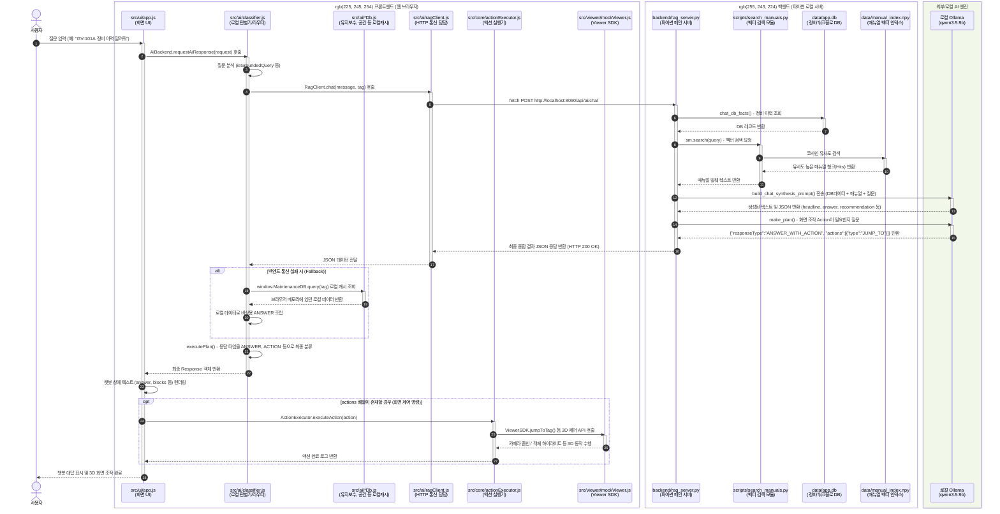

# i3dweb_mock 전체 모듈 상세 통신 흐름도

사용자가 채팅창에 입력을 한 순간부터, 이 프로젝트에 존재하는 **모든 세부 모듈들이 어떻게 상호작용하는지 생략 없이** 나타낸 시퀀스 다이어그램입니다.

### 🔍 다이어그램 주요 모듈 설명

1. **`src/ui/app.js`**: 사용자의 입력을 가로채고, 모든 과정이 끝난 뒤 최종적으로 챗봇 말풍선과 UI를 화면에 그립니다.
2. **`src/ai/classifier.js`**: 프론트엔드의 메인 두뇌입니다. 백엔드로 통신을 넘길지 말지 결정하고, 백엔드가 죽었을 때 `src/ai/maintenanceDb.js` 같은 **로컬 DB(캐시)**를 뒤져서 비상 대답을 만들어내는 역할을 합니다.
3. **`src/ai/ragClient.js`**: 파이썬과 `fetch`로 통신하는 배달부 역할만 수행합니다.
4. **`backend/rag_server.py`**: 백엔드의 메인 두뇌입니다. 들어온 질문을 보고 `sqlite3`(정형 데이터)를 뒤질지, `scripts/search_manuals.py`(비정형 매뉴얼)를 뒤질지 결정합니다.
5. **로컬 Ollama**: 파이썬이 찾아낸 DB 기록과 매뉴얼 원문을 조합해서 사람이 읽기 좋은 문장과 화면 제어용 뼈대(JSON)를 만들어줍니다.
6. **`src/core/actionExecutor.js` & `ViewerSDK`**: AI가 만들어낸 명령어를 실제 3D 화면 엔진이 이해할 수 있는 함수로 변환하여 실행합니다.
