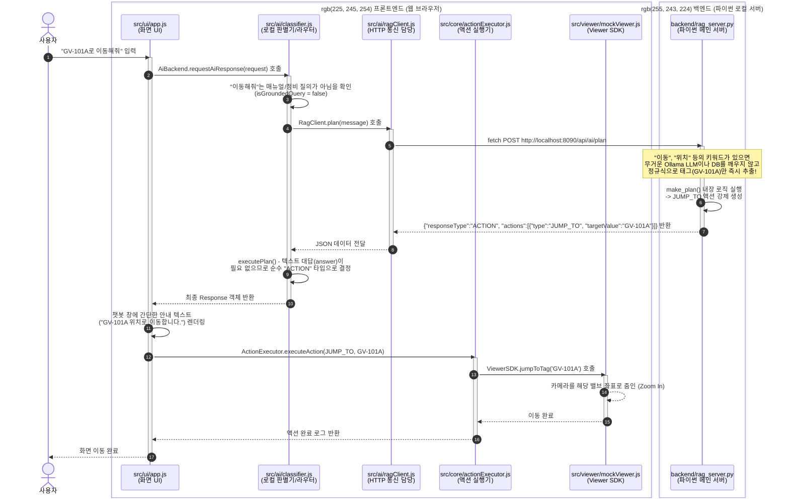

# i3dweb_mock 통신 흐름도 - ACTION 특화 (단순 화면 이동)

사용자가 채팅창에 **"GV-101A로 이동해줘"**라고 입력했을 때, 백엔드의 AI나 DB 검색을 굳이 거치지 않고 가장 빠르고 효율적으로 3D 화면을 조작(ACTION)하는 과정을 보여주는 시퀀스 다이어그램입니다.

### 🔍 이전 다이어그램(종합 챗봇)과의 핵심 차이점

이전 다이어그램(답변 포함)과 비교했을 때, 순수하게 화면만 제어하는 **ACTION** 플로우의 특징은 다음과 같습니다.

1. **오직 `/api/ai/plan` 직통 주소만 사용**: 종합 안내데스크인 `/api/ai/chat`을 거치지 않습니다.
2. **LLM(Ollama) 완전 배제**: 단순 이동 명령은 파이썬 내부의 정규식 매칭(Fast-path)으로 0.01초 만에 끝납니다. 값비싸고 느린 인공지능을 부르지 않습니다.
3. **DB 및 벡터 검색 배제**: 정비 이력을 묻거나 매뉴얼을 묻는 것이 아니므로 SQLite나 numpy 인덱스 파일에 접근조차 하지 않습니다.
4. 프론트엔드는 텍스트(Answer)를 조립하느라 고생할 필요 없이 바로 `ActionExecutor`에 명령을 하달하여 3D 화면을 움직입니다.
