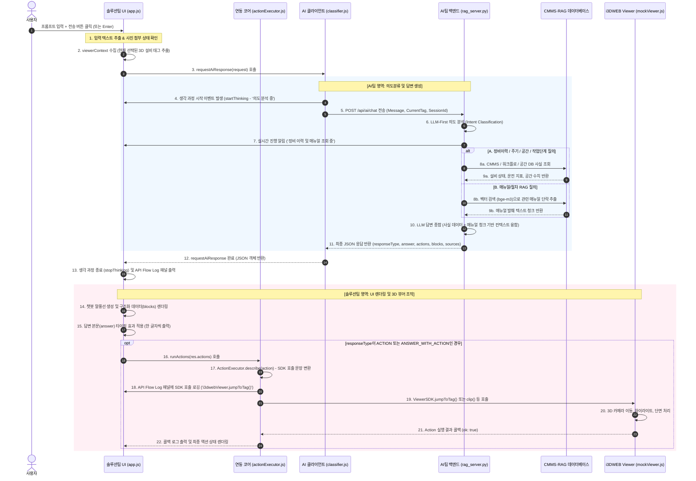

# i3DWEB AI 챗봇 — 기능별 상세 내부 프로세스 및 역할 분담 가이드

> **작성일:** 2026-07-16**대상:** AI팀 / 솔루션팀 / 시스템 아키텍트**관련 문서:**
>
> - [AI챗봇_기능_및_프롬프트_가이드.md](file:///c:/lyn/i3dweb_mock/docs/AI챗봇_기능_및_프롬프트_가이드.md)
> - [AI팀_솔루션팀_API_전달영역.md](file:///c:/lyn/i3dweb_mock/docs/AI팀_솔루션팀_API_전달영역.md)
> - [채팅동작_솔루션팀_연동가이드.md](file:///c:/lyn/i3dweb_mock/docs/채팅동작_솔루션팀_연동가이드.md)

---

## 1. 개요 및 설계 원칙

본 문서는 i3DWEB AI 챗봇 시스템에 구현된 각 기능별 내부 작동 프로세스를 명확히 규정하고, **AI팀(지능형 서비스 및 백엔드)**과 **솔루션팀(3D 화면 제어 및 UI/UX)**의 역할 경계를 세부적으로 정의합니다.

### 💡 핵심 협업 원칙 (LLM-first & Fact-grounded)

1. **AI팀은 "무엇을(What)" 답하고 "어떤 동작(Action)"이 필요한지 결정**합니다. 자연어 의도 해석, RAG 검색, CMMS/워크플로 DB 사실 정보 매핑, 액션 JSON 판단을 담당합니다.
2. **솔루션팀은 이를 "어떻게(How)" 화면에 렌더링하고, Viewer SDK를 통해 실행할지 담당**합니다. 채팅 말풍선 UI 표현(막대그래프, 표, 타이핑 애니메이션 등), 3D 모델의 실제 제어(이동/숨김/단면 등), 공간/측량 정보 수집을 수행합니다.
3. **환각 방지(Hallucination Prevention)**: 사실(수치, 이력, 단계)은 DB/매뉴얼에서만 직접 추출합니다. LLM은 문맥 이해와 자연스러운 문장 종합만 담당합니다.

---

## 2. AI팀 vs 솔루션팀 역할 및 영역 구분

디렉토리 구조와 시스템 구성요소에 따른 양 팀의 담당 영역과 세부 역할은 다음과 같습니다.

### 2.1 디렉토리 및 소스코드 수준의 역할 구분

```
i3dweb_mock/
├── backend/                  ── [🤖 AI팀 영역]
│   └── rag_server.py         - Python 백엔드 서버, RAG 검색엔진, CMMS/Workflow 모의 DB
├── src/
│   ├── ai/                   ── [🤖 AI팀 영역]
│   │   ├── classifier.js     - 자연어 의도 분류 및 규칙 검사기
│   │   ├── ragClient.js      - AI 백엔드 서버와의 API 통신 클라이언트
│   │   ├── maintenanceDb.js  - 모의 정비이력(CMMS) 로컬 캐시/DB
│   │   └── workflowDb.js     - 모의 작업오더(WO) 상태 로컬 캐시/DB
│   │
│   ├── viewer/               ── [🖥️ 솔루션팀 영역]
│   │   ├── mockViewer.js     - 3D Viewer SDK 인터페이스 및 카메라/렌더링 제어 본체
│   │   └── spatialDb.js      - Walkinside 3D 공간 데이터(높이, 추락위험 등) 모의 DB
│   │
│   ├── core/                 ── [🌉 두 팀의 교차점 / 통역사]
│   │   └── actionExecutor.js - AI Action JSON을 Viewer SDK 함수로 매핑/실행
│   │
│   └── ui/                   ── [🖥️ 솔루션팀 영역]
│       ├── app.js            - 채팅 UI 조작, 이벤트 바인딩, 생각 과정 오케스트레이션
│       └── styles.css        - 레이아웃 및 컴포넌트 디자인 CSS
```

### 2.2 기능별 책임 한계 세부 조견표

| 구분                     | 🤖 AI팀 담당 영역 (API 백엔드)                                                                                               | 🖥️ 솔루션팀 담당 영역 (Frontend / Viewer)                                                                     |
| ------------------------ | ---------------------------------------------------------------------------------------------------------------------------- | --------------------------------------------------------------------------------------------------------------- |
| **입력 및 문맥**   | - 전송된 메시지의 자연어 의도 분류- 멀티턴 대화 세션 관리 및 대명사(그거, 이 밸브) 복원                                      | - 채팅 입력창 UI 및 파일/사진 첨부 버튼 제공- 현재 Viewer에서 선택된 설비 태그(`currentTag`) 전송             |
| **답변 콘텐츠**    | - 사실(DB)에 기반한 판정 텍스트 생성- UI 구성 힌트 전달 (`uiKind`, `tone` 등)- 표, 리스트 등 마크다운/구조화 데이터 생성 | - 수신된 마크다운을 HTML로 컴포넌트화- 폰트, 여백, 경고 테두리 스타일링- 타이핑(한 글자씩 출력) 애니메이션 구동 |
| **3D Viewer 동작** | - 필요한 Action 종류 결정 (`JUMP_TO`, `CLIP` 등)- 대상 설비 태그(`targetValue`) 및 옵션 파라미터 결정                  | - AI가 보낸 Action JSON을 SDK 호출로 매핑- 3D 공간 내 렌더링, 시점 이동, 단면 슬라이스 연동                     |
| **사진/비전 진단** | - 이미지 내 명판 태그 문자 인식(OCR)- 외관 이상 상태 판독 및 RAG 기반 조치법 연계                                            | - 카메라 캡처/사진 파일 로드 UI 및 미리보기- Base64 이미지 변환 후 API payload 전송                             |
| **오류 및 폴백**   | - LLM/DB 호출 실패 시 HTTP 에러 코드/메시지 반환- Ollama(로컬) 엔진으로 자동 폴백                                            | - API 장애 시 로컬 키워드 규칙 필터로 폴백 구동- 오류 메시지 노출 및 재시도 제공                                |

---

## 3. 사용자 프롬프트 입력부터 3D Viewer 조절까지의 상세 프로세스

사용자가 프롬프트를 입력하고 전송 버튼을 클릭한 순간부터 3D Viewer 조작과 답변 렌더링이 완료되기까지의 전체 데이터 흐름입니다.

### 3.1 시퀀스 다이어그램 (Sequence Diagram)



### 3.2 단계별 상세 데이터 흐름 및 기술적 내용

#### [1단계] 사용자 입력 및 컨텍스트 수집 (솔루션팀 영역)

* **트리거**: 사용자가 채팅창에 "TG-PMP-101 정비 이력 알려주고 위치도 보여줘"를 입력하고 전송 버튼(`sendBtn`)을 클릭합니다.
* **프로세스**:
  - `app.js`에서 입력창 `#userInput`의 텍스트 값을 수집합니다.
  - 현재 3D 뷰어에서 선택되어 화면에 표시 중인 설비의 태그명(`viewerTagEl.textContent`)을 읽어와 `viewerContext.currentTag`에 바인딩합니다.
* **데이터 생성 예시 (Request)**:
  ```json
  {
    "sessionId": "sess-a12b34",
    "message": "TG-PMP-101 정비 이력 알려주고 위치도 보여줘",
    "viewerContext": {
      "currentTag": "TG-PMP-101"
    }
  }
  ```

#### [2단계] API 호출 및 생각 과정 동적 표시 (솔루션팀 UI ↔ AI팀 클라이언트)

* **프로세스**:
  - `app.js`는 `AiBackend.requestAiResponse(request)`를 호출합니다.
  - 비동기 처리 중 UI가 멈춘 것처럼 보이지 않도록 `startThinking()`을 구동하여 채팅창 하단에 "요청을 분석하고 있습니다..." 등의 생각 과정 패널을 노출합니다.
  - AI 백엔드 통신 상태를 모니터링하기 위해 API Flow 패널에 HTTP 요청 로그를 추가합니다.

#### [3단계] 의도 분석 및 분류 (AI팀 백엔드 영역)

* **프로세스**:
  - Python 백엔드 `rag_server.py`는 `POST /api/ai/chat` 요청을 받습니다.
  - LLM(`gpt-4o-mini` 또는 로컬 `qwen3.5:9b`)을 사용하여 사용자의 의도를 분석합니다.
  - 이 문장은 질문(ANSWER)과 뷰어 조작(ACTION)이 섞여 있으므로 `responseType: "ANSWER_WITH_ACTION"`으로 분류됩니다.
  - 필요한 조치는 ① `QUERY_MAINTENANCE` (정비 이력 데이터 조회)와 ② `JUMP_TO` (카메라 이동 액션) 두 가지로 결정됩니다.
  - 실시간 분류 힌트를 프런트엔드 진행 단계 이벤트(`notifyProgress`)를 통해 전달하여 UI 생각 과정을 "정비 이력과 매뉴얼을 조회하고 있습니다..."로 업데이트합니다.

#### [4단계] 데이터 조회 및 RAG 검색 (AI팀 백엔드 영역)

* **프로세스**:
  - **DB 사실 조회**: `QUERY_MAINTENANCE` 의도에 따라, 서버 내부의 CMMS DB에서 `TG-PMP-101`에 해당하는 정비 기록(최근 분해 정비일, 누설 이력 건수, Open Point 등)을 SQL 쿼리로 조회합니다.
  - **RAG 검색 (해당하는 경우)**: 만약 절차나 기준을 묻는 매뉴얼 질문인 경우, 임베딩 모델(`bge-m3`)을 통해 질문 벡터를 생성하고 지침서 Vector DB에서 연관 단락을 조회해 옵니다.

#### [5단계] 답변 생성 및 응답 반환 (AI팀 백엔드 영역)

* **프로세스**:
  - 조회한 실제 DB 데이터(사실 정보)와 지침서 텍스트를 LLM의 프롬프트 컨텍스트에 주입합니다.
  - LLM은 주어진 사실 정보에만 근거하여 사용자에게 친절한 어조로 답변을 구성합니다. (환각 차단)
  - 3D Viewer를 조작할 수 있는 표준 JSON 액션 배열을 빌드하여 응답을 반환합니다.
* **데이터 반환 예시 (Response JSON)**:
  ```json
  {
    "responseType": "ANSWER_WITH_ACTION",
    "category": "maintenance",
    "headline": "TG-PMP-101 최근 정비 이력 및 위치",
    "message": "TG-PMP-101의 정비 이력 정보를 조회하였으며, 설비 위치로 카메라를 이동합니다.",
    "answer": "해당 설비는 2026-02-12에 마지막 분해정비(WO-2026-0105)가 완료되었으며, 당시 베어링 및 가스켓 교체가 진행되었습니다. 다만, 최근 그랜드패킹 부위에서 미세 누설이 1건 보고되어 반복 이상 징후로 특별 관리 중입니다.",
    "blocks": [
      {
        "kind": "histTable",
        "title": "정비 이력 현황",
        "rows": [
          { "date": "2026-02-12", "kind": "분해정비", "result": "정상", "worker": "홍길동", "wo": "WO-2026-0105", "items": ["베어링 교체", "가스켓 신품 교체"] },
          { "date": "2026-05-14", "kind": "누설점검", "result": "확인 필요", "worker": "김철수", "wo": "WO-2026-0412", "items": ["그랜드패킹 미세누설 발생"] }
        ]
      }
    ],
    "actions": [
      {
        "type": "JUMP_TO",
        "targetType": "TAG",
        "targetValue": "TG-PMP-101",
        "params": {}
      }
    ],
    "sources": [
      { "type": "maintenance", "label": "CMMS 정비이력 DB", "detail": "TG-PMP-101" }
    ],
    "confidence": 0.98,
    "grounded": true
  }
  ```

#### [6단계] UI 렌더링 및 타이핑 애니메이션 (솔루션팀 영역)

* **프로세스**:
  - `app.js`에서 API 응답을 받아 `stopThinking()`으로 로딩 표시를 제거합니다.
  - 말풍선 카드를 동적으로 만들고 `blocks` 내의 구조화 데이터(여기서는 `histTable` 정비이력 테이블)를 HTML 컴포넌트로 파싱해 화면에 즉시 렌더링합니다.
  - 본문 답변(`answer`)은 한 글자씩 타이핑 효과(`typeText`)로 나타나 대화형 어시스턴트 느낌을 강조하고, 타이핑이 끝나면 마크다운 서식을 입히고 하단에 출처 칩(`sources`)과 피드백 버튼을 붙입니다.

#### [7단계] 3D Viewer 조작 (솔루션팀 ↔ Viewer SDK 영역)

* **프로세스**:
  - 응답의 `responseType`이 `ANSWER_WITH_ACTION`이므로 `runActions(res)`를 호출합니다.
  - `actionExecutor.js`의 `ActionExecutor.executeAction(action)`으로 전달됩니다.
  - 레지스트리 매핑 규칙에 따라 `JUMP_TO` 액션은 `ViewerSDK.jumpToTag("TG-PMP-101", {})`로 변환되어 즉시 실행됩니다.
  - 3D Viewer 윈도우는 카메라 시점을 `TG-PMP-101`로 부드럽게 이동(Fly-to)시키고, 해당 3D 오브젝트 외곽선에 하이라이트(Glow) 효과를 줍니다.
  - Viewer가 동작을 완료하면 `ActionExecutor`에 실행 결과 콜백(예: `{ ok: true, message: "TG-PMP-101 이동 완료" }`)을 주어 API Flow 패널 및 로그 콘솔에 기록합니다.

---

## 4. 기능별 상세 내부 프로세스 명세

`AI챗봇_기능_및_프롬프트_가이드.md`에 명시된 기능들이 내부적으로 어떤 프로세스를 거쳐 AI와 Viewer 사이를 연결하는지 세부 명세입니다.

---

### 4-1. 뷰어 조작 (솔루션팀 Viewer SDK 연동 20종)

#### 1) 카메라 및 시점 제어

* **기능 목록**: `JUMP_TO`(태그 이동), `TOP_VIEW`(윗면), `FRONT_VIEW`(정면), `SIDE_VIEW`(측면), `ISO_VIEW`(아이소뷰), `HOME`(홈)
* **AI팀 프로세스**:
  - 프롬프트에서 설비 태그(예: "GV-101A") 및 방향성 명사("위", "옆", "앞", "아이소")를 추출합니다.
  - 대상 태그가 문장에 없고 현재 선택된 태그도 없다면 JUMP_TO 대신 `SEARCH` 액션을 발행합니다.
* **솔루션팀 프로세스**:
  - `actionExecutor.js`에서 각 액션에 맞춰 뷰어 SDK API를 매핑하여 호출합니다.
* **API 데이터 규격 & SDK 매핑**:
  ```json
  // JUMP_TO 액션 예시
  { "type": "JUMP_TO", "targetType": "TAG", "targetValue": "GV-101A" }
  ```

  * **SDK 호출**: `ViewerSDK.jumpToTag("GV-101A", params)`
  * **시점 프리셋 (TOP/FRONT/SIDE/ISO)**: `ViewerSDK.presetView("top" | "front" | "side" | "iso", tag)`
  * **홈으로 이동**: `ViewerSDK.home()`

#### 2) 단면 표시 및 조작 (클리핑)

* **기능 목록**: `CLIP`(단면 켜기/끄기), `CLIP_AXIS`(축 변경), `CLIP_FLIP`(반전), `CLIP_SIZE`(크기 조정)
* **AI팀 프로세스**:
  - "잘라줘", "단면", "안쪽 보여줘" 등의 표현 시 `CLIP { params: { on: true } }`를 결정합니다.
  - "상하/좌우/전후로 축 변경" 지시 시 `CLIP_AXIS`를 발생시키고 `targetValue`에 축 값(`TB` / `LR` / `FB`)을 세팅합니다.
* **솔루션팀 프로세스**:
  - 3D Viewer 내에 클리핑 플레인(Clipping Plane)을 활성화하여 설비 단면을 깎아 렌더링하고 축과 오프셋 크기를 조절합니다.
* **API 데이터 규격 & SDK 매핑**:
  ```json
  // CLIP 켜기 액션 예시
  { "type": "CLIP", "targetValue": "GV-101A", "params": { "on": true } }
  ```

  * **단면 제어**: `ViewerSDK.clip("GV-101A", true | false)`
  * **단면 축 변경**: `ViewerSDK.clipAxis("TB" | "LR" | "FB")`
  * **단면 축 반전**: `ViewerSDK.clipFlip()`
  * **단면 사이즈 조정**: `ViewerSDK.clipSize(sizeValue)`

#### 3) 객체 표시 및 숨김 제어

* **기능 목록**: `SHOW_ONLY`(그것만 표시), `HIDE`(숨김), `HIDE_ALL`(전체 숨김), `SHOW_ALL`(전체 복구), `UNSELECT_ALL`(선택 해제)
* **AI팀 프로세스**:
  - **[주의]** "X 빼고 다 숨겨줘"는 `SHOW_ONLY { targetValue: X }`이며, "X 숨겨줘"는 `HIDE { targetValue: X }`로 매핑하여 긍정/부정을 정확히 구분합니다.
* **솔루션팀 프로세스**:
  - 뷰어 엔진 노드 트리에서 대상 태그 혹은 설비 타입(`PUMP`, `VALVE` 등) 노드의 가시성(Visibility) 속성을 활성/비활성화합니다.
* **API 데이터 규격 & SDK 매핑**:
  ```json
  // HIDE 액션 예시 (특정 타입 전체 숨김)
  { "type": "HIDE", "targetType": "TYPE", "targetValue": "PUMP" }
  ```

  * **그것만 표시**: `ViewerSDK.showOnly({ by: "TAG" | "TYPE", value: "targetValue" })`
  * **숨김**: `ViewerSDK.hide({ by: "TAG" | "TYPE", value: "targetValue" })`
  * **전체 숨김**: `ViewerSDK.hideAll()`
  * **전체 표시**: `ViewerSDK.show({ value: "ALL" })`

#### 4) 화면 요소 및 연계 화면 조작

* **기능 목록**: `AVATAR`(아바타 가이드), `KEY_MAP`(키맵/미니맵), `PID`(연계 도면), `MONITORING`(실시간 모니터링), `SEARCH`(문자열 검색)
* **AI팀 프로세스**:
  - 켜고 끄는 지시어에 맞춰 `params.on`을 `true` 혹은 `false`로 세팅합니다.
* **솔루션팀 프로세스**:
  - 3D 공간 내 아바타 캐릭터 활성화, 미니맵 HUD 레이어 표시, 화면 오른쪽/왼쪽에 P&ID 도면 팝업창 띄우기, 실시간 모니터링 대시보드 오버레이 등을 조작합니다.
* **API 데이터 규격 & SDK 매핑**:
  ```json
  // PID 도면 켜기 액션 예시
  { "type": "PID", "targetValue": "GV-101A", "params": { "on": true } }
  ```

  * **아바타 ON/OFF**: `ViewerSDK.avatar(true | false)`
  * **키맵 ON/OFF**: `ViewerSDK.keyMap(true | false)`
  * **P&ID 도면 표시**: `ViewerSDK.showPID(tag)` / `ViewerSDK.hidePID()`
  * **실시간 모니터링**: `ViewerSDK.monitoring(tag, true | false)`
  * **문자열 검색**: `ViewerSDK.searchEquipment(query)`

---

### 4-2. 작업 안내 (3D 공간 정보 활용 기능)

* **기능 목록**: `SHOW_INSPECTION_ROUTE`(점검동선), `FIND_NEAREST`(최근접점검대상), `SHOW_WORKER_POSITION`(작업자서야하는위치), `MOVE_TO_INSPECTION`(점검위치로이동), `SHOW_PATH`(비상경로표시), `SHOW_WORK_ZONE`(정비구역표시)
* **AI팀 프로세스**:
  - "비상구 탈출 경로", "작업 구역 표시" 등 공간 시뮬레이션 관련 어휘가 확인되면 작업 안내 액션을 발행합니다.
* **솔루션팀 프로세스**:
  - 3D 공간 상의 좌표 정보(`spatialDb.js`)를 바탕으로 동선 라인을 그리거나, 아바타를 점검 위치로 좌표 이동시키거나, 설비 하부에 작업 반경 2m 크기의 원형 데칼(Decal) 링을 렌더링합니다.
* **API 데이터 규격 & SDK 매핑**:
  ```json
  // SHOW_PATH 액션 예시 (비상구 경로)
  { "type": "SHOW_PATH", "target": "EMERGENCY_EXIT" }
  ```

  * **점검 위치 이동**: `ViewerSDK.moveToInspection(tag)`
  * **경로 가이드**: `ViewerSDK.showPath("EMERGENCY_EXIT" | "OPERATION_POS" | tag)`
  * **점검 동선 가이드**: `ViewerSDK.showInspectionRoute()`
  * **최근접 대상 찾기**: `ViewerSDK.findNearest()`
  * **작업자 서는 위치**: `ViewerSDK.showWorkerPosition(tag)`
  * **정비 구역 가시화**: `ViewerSDK.showWorkZone(tag)`

---

### 4-3. 데이터 질의 (DB 기반 사실적 리치 카드)

* **기능 목록**: `QUERY_MAINTENANCE`(정비 이력), `QUERY_CYCLE`(정비 주기), `QUERY_SPATIAL`(작업 조건/안전), `QUERY_WORKFLOW`(작업 단계)
* **AI팀 프로세스**:
  - 사용자가 특정 설비의 과거 사실(수치, 일정, 이력 등)을 질문하면, 자연어 의도를 `QUERY_*` 액션과 `field` 속성으로 매핑합니다.
  - 서버는 CMMS DB 또는 작업오더(WO) DB에서 질의에 해당하는 사실 테이블을 조회합니다.
  - 조회한 원본 데이터는 응답 JSON의 `retrieval.data`에 보관하여 프런트엔드로 넘기고, LLM은 이 사실만을 요약 종합합니다.
* **솔루션팀 프로세스**:
  - `retrieval.data`에 담겨온 구조화 데이터를 가공하여, 일반 텍스트 대신 **전문 메트릭 카드, 비교 테이블, 색상 칩 상태바**로 렌더링합니다.
  - 예: 정비이력은 날짜/WO번호/작업내용이 포함된 테이블로 렌더링하고, 정비주기는 초과일을 계산하여 주황색 경고 띠로 표시합니다.
* **API 데이터 규격**:
  ```json
  {
    "type": "QUERY_MAINTENANCE",
    "targetValue": "TG-PMP-101",
    "field": "history"
  }
  ```
* **데이터 흐름**:
  ```
  사용자 질문 ──→ AI 백엔드 ──→ CMMS/WO DB 쿼리 ──→ JSON 응답 (retrieval.data 주입) 
                                                                  │
  3D 뷰어 제어 없음 ←── UI 렌더러 (maint-table 및 metric-card 컴포넌트화) 팝업 렌더링
  ```

---

### 4-4. 매뉴얼 검색 (RAG 벡터 검색)

* **기능 목록**: `MANUAL_RAG` (지침서 지식 검색)
* **AI팀 프로세스**:
  - "보닛 볼트 토크 기준", "그랜드패킹 교체 순서" 등 정비 절차서 내부의 정보 검색을 요청할 경우입니다.
  - 질문 내용에 맞는 검색 쿼리를 추출하고, `valveType`("gate" | "globe" | "pump" 등) 필터를 함께 생성합니다.
  - `bge-m3` 임베딩 모델을 사용하여 백엔드 벡터 저장소에서 연관 청크를 로드한 뒤, LLM이 해당 문맥(Context)만을 참조하여 답변을 생성합니다.
  - 답변에 정확한 출처 정보를 표기하기 위해 `manualExcerpt`에 지침서 파일명, 섹션 경로, 페이지 번호, 발췌 원문을 바인딩합니다.
* **솔루션팀 프로세스**:
  - 챗봇 말풍선 하단에 접이식(Accordion UI) 컴포넌트로 지침서 발췌 영역을 만들고 클릭 시 상세 원문과 페이지가 펼쳐지도록 렌더링합니다.
* **API 데이터 규격**:
  ```json
  {
    "type": "MANUAL_RAG",
    "query": "그랜드패킹 교체 절차",
    "valveType": "pump"
  }
  ```

---

### 4-5. 박람회 시연 특별 데모 기능

#### 1) 오늘 점검 브리핑 (Agent Briefing)

* **사용자 입력**: "오늘 점검할 대상 브리핑해줘" / "오늘 뭐 해야 돼?"
* **AI팀 프로세스**:
  - 의도를 `BRIEFING` 액션으로 식별합니다.
  - DB에서 오늘 날짜 기준으로 주기 초과이거나 긴급 점검이 예정된 대상 4건(TG-PMP-101, GV-101A 등)을 추출하고, 긴급 등급과 상태 요약 정보를 빌드합니다.
* **솔루션팀 프로세스 (멀티스텝 시퀀스 오케스트레이션)**:
  - 브리핑은 챗봇이 단순히 답을 하는 것에 그치지 않고 **대화와 3D 뷰어 조작이 연동되어 자동 시연되는 에이전트 모드**입니다.
  - **순차 실행 프로세스**:
    1. **1단계 (브리핑 개시)**: 챗봇이 "오늘 점검 브리핑을 시작하겠습니다."라는 타이핑 메시지와 함께 오늘 점검 대상 목록 4건 요약 카드(`inspectionBriefing` 블록)를 화면에 렌더링합니다.
    2. **2단계 (카메라 자동 점프)**: Viewer에 `JUMP_TO`를 내려보내 `TG-PMP-101`로 카메라 시점을 자동으로 부드럽게 이동하고 하이라이트합니다.
    3. **3단계 (내부 단면 자동 표시)**: Viewer에 `CLIP` 액션을 호출하여 펌프를 잘라 내부 그랜드패킹 단면을 붉게 반짝이며 시각화합니다.
    4. **4단계 (작업 구역 자동 가시화)**: Viewer에 `SHOW_WORK_ZONE` 액션을 호출하여 바닥면에 반경 2m의 노란색 정비 구역 데칼을 생성하고 안전조치 사항을 챗봇 텍스트로 타이핑 출력합니다.

#### 2) 사진 진단 (Vision AI)

* **사용자 입력**: (현장 이상 사진 첨부) + "이 설비 진단해줘"
* **솔루션팀 프로세스**:
  - 사용자가 모바일/태블릿 카메라로 현장 사진을 촬영하거나 이미지 파일을 입력창에 드롭하면 이미지 미리보기를 표시하고 Base64 Data URL 형식으로 포맷팅합니다.
  - 전송 클릭 시 메시지와 함께 `image` 필드에 바인딩하여 전송합니다.
* **AI팀 프로세스**:
  - `POST /api/ai/chat` (또는 `/api/ai/vision`)로 전달된 이미지를 받아 OpenAI GPT-4o-mini Vision API를 구동합니다.
  - 이미지 내 설비 명판이나 라벨 정보를 인식해 설비 태그(`5-4H31-J043C3`)를 추출합니다.
  - 설비 표면의 이상 징후(누설, 부식, 파손 등)와 심각도 수준(`정상` | `주의` | `위험`)을 판독합니다.
  - 판독 결과로 추출한 태그 기반으로 매뉴얼 RAG와 CMMS DB를 재검색하여 최종 진단 리치 답변과 모니터링 실행 액션(`MONITORING`)을 응답합니다.
* **API 데이터 규격 (Request)**:
  ```json
  {
    "sessionId": "sess-a12b34",
    "message": "이 장비 상태 진단하고 모니터링 켜줘",
    "image": "data:image/jpeg;base64,..."
  }
  ```

#### 3) 생각 과정 (Thinking Process) 및 타이핑 효과 (Typing Effect)

* **AI팀 프로세스**:
  - 백엔드 내부 연산 단계(의도분류 → DB조회 → RAG검색 → 답변조합)가 진행될 때마다 API 응답 지연 중간에 실시간 상태 이벤트를 던집니다.
* **솔루션팀 프로세스**:
  - 수신된 이벤트에 따라 화면 말풍선 위에 "정비 이력과 매뉴얼을 조회하고 있습니다..." 등의 진행 단계를 로딩 도트 애니메이션과 함께 교체해 가며 출력합니다.
  - 최종 답변 수신 시 본문을 마크다운 렌더링하기 전, 한 글자씩 타이핑 출력(`typeText`)을 주어 지연 시간을 자연스럽게 수용하고 대화 몰입감을 부여합니다.

---

## 5. 예외 처리 및 폴백(Fallback) 시나리오

네트워크 장비 불안정, AI API 키 만료, 로컬 Ollama 백엔드 오프라인 등 시연 중 발생 가능한 다양한 에러 상황에 대한 이중 안전장치 프로세스입니다.

```
                  사용자 입력 전송
                         │
                         ▼
             [LLM-first OpenAI API] 
                         │
        ┌────────────────┴────────────────┐
     정상 작동                          서버 에러/API 키 만료
        │                                 │
        ▼                                 ▼
   LLM JSON 생성                    [로컬 Ollama qwen3 폴백]
   & RAG DB 리치 답변                     │
                                ┌─────────┴─────────┐
                             정상 작동            Ollama 오프라인/연결 실패
                                │                   │
                                ▼                   ▼
                            로컬 LLM 응답      [클라이언트 규칙 필터]
                                               (src/ai/classifier.js)
                                                    │
                                                    ▼
                                             키워드 정밀 매치
                                             & mock DB 기반 
                                             안전 답변 및 Mock 액션 실행
```

1. **OpenAI API 장애 시**:
   - 백엔드 `rag_server.py`는 OpenAI 키 미설정 또는 호출 실패 감지 시 즉시 로컬에 설치된 Ollama(`qwen3.5:9b`) 엔진으로 폴백하여 오프라인으로 쿼리 해석을 완수합니다.
2. **백엔드 서버 전체 오프라인 시 (네트워크 오류)**:
   - 프론트엔드 `app.js`에서 백엔드 HTTP 500 또는 통신 거부를 감치하면 `try/catch` 블록이 실행됩니다.
   - 즉시 브라우저 로컬 자바스크립트로 구동되는 규칙 분류기 `classifyRuleBased()`로 제어권이 넘어갑니다.
   - 키워드 매칭(예: "정비 이력" → `MaintenanceDB` 캐시 조회, "단면" → `CLIP` 액션 강제 빌드)을 수행하여, 백엔드가 꺼져 있어도 화면 조작 및 정비 데이터 답변이 완벽하게 시뮬레이션되도록 지원합니다.

---

## 6. 결론 및 최종 연동 검증 인수 기준

본 아키텍처에 근거해 양 팀의 컴포넌트가 안정적으로 연동되었는지 검증하는 기준 목록입니다.

* [ ] AI 백엔드 응답 데이터 내의 `actions[].targetValue`와 본문에 표기된 설비 명칭/태그명이 항상 일치해야 한다.
* [ ] AI팀은 소스코드 내에 어떠한 HTML 태그, CSS 인라인 스타일, 또는 DOM 조작(jQuery/Vanilla JS)을 주입하지 않으며 오직 순수 JSON 데이터만 전달한다.
* [ ] 솔루션팀은 AI 백엔드가 반환한 DB 팩트 판정문(`headline`, `answer`, `blocks`)의 수치나 경고 상태 등의 값을 프런트엔드 스크립트에서 임의로 수정하거나 직접 지어내지 않는다.
* [ ] 사진 첨부 단독 행동만으로는 모니터링(`MONITORING`)이 실행되지 않아야 하며, 사용자가 질문을 입력하고 전송 버튼을 명시적으로 클릭했을 때에만 분석 후 실행되어야 한다.
* [ ] AI 서버가 중단된 폐쇄망 상태에서도 프런트엔드의 규칙 폴백 엔진에 의해 20종의 뷰어 제어 동작과 mock 데이터 답변 카드가 정상 노출되어야 한다.
