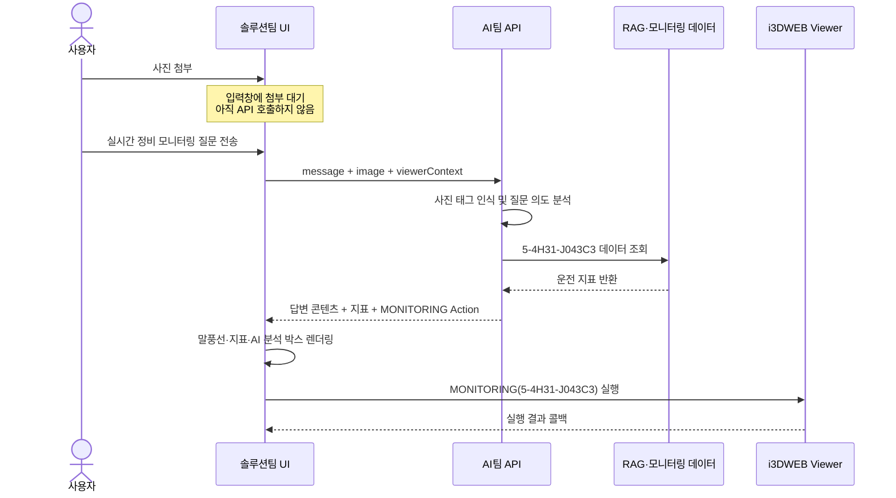

# AI팀 → 솔루션팀 API 전달 영역 정의

## 1. 목적

이 문서는 i3DWEB AI Assistant에서 **AI팀이 API로 생성·전달하는 영역**과 **솔루션팀이 화면 및 Viewer에서 처리하는 영역**을 구분한다.

핵심 원칙은 다음과 같다.

> AI팀은 **무엇을 답하고 어떤 동작이 필요한지** 결정하고, 솔루션팀은 이를 **어떻게 표시하고 i3DWEB에서 어떻게 실행할지** 담당한다.

---

## 2. 팀별 책임 경계

| 구분 | AI팀 | 솔루션팀 |
|---|---|---|
| 사용자 질문 | 질문 의도와 멀티턴 문맥 해석 | 입력창에서 질문을 받아 API로 전달 |
| 사진 | 설비 종류·명판·태그 번호 인식 | 사진 첨부, 화면 캡처, 미리보기, 삭제 UI 제공 |
| RAG | 검색어 생성, 문서 검색, 근거 선정, 답변 생성 | 출처 및 발췌 내용을 UI로 표시 |
| 답변 콘텐츠 | 제목, 본문, 수치, 상태, 점검 항목, AI 분석 문장 생성 | 말풍선, 글꼴, 여백, 테두리, 색상, 지표 막대 렌더링 |
| Viewer 동작 | 필요한 Action 종류와 대상 태그 결정 | Action을 Viewer SDK 호출로 변환하고 실제 실행 |
| 오류 | AI·RAG 처리 오류 코드와 메시지 반환 | 오류 메시지, 재시도, 로딩 상태를 화면에 표시 |

### 답변 말풍선 기준

- 말풍선 외형, 테두리, 배경색, 타이핑 효과: **솔루션팀**
- 말풍선 안의 문장, 수치, 판정, 점검 순서, 출처: **AI팀**
- `경고`, `주의`, `정상`과 같은 의미 상태: **AI팀**
- 경고를 빨간색으로 표현할지, 주황색으로 표현할지: **솔루션팀**

---

## 3. 솔루션팀 → AI팀 요청 데이터

솔루션팀은 사용자 입력과 현재 i3DWEB 문맥을 AI팀 API로 전달한다.

### 3.1 일반 채팅 요청

`POST /api/ai/chat`

```json
{
  "sessionId": "sess-a12b34",
  "message": "원심펌프 정비 시 공구 낙하와 이물질 유입을 어떻게 방지하고, 세척제는 어떤 기준으로 사용해야 해?",
  "viewerContext": {
    "currentTag": "TG-PMP-101"
  }
}
```

| 필드 | 제공 팀 | 설명 |
|---|---|---|
| `sessionId` | 솔루션팀 | 멀티턴 대화를 연결할 세션 식별자 |
| `message` | 솔루션팀 | 사용자가 입력한 원문 |
| `viewerContext.currentTag` | 솔루션팀 | i3DWEB에서 현재 선택된 설비 태그 |

### 3.2 사진 포함 요청

`POST /api/ai/vision` 또는 통합 `POST /api/ai/chat`

```json
{
  "sessionId": "sess-a12b34",
  "message": "이 장비 실시간 정비 모니터링 상태 좀 보여줘",
  "image": "data:image/jpeg;base64,...",
  "viewerContext": {
    "currentTag": null
  }
}
```

사진을 선택하거나 캡처한 것만으로 API를 호출하지 않는다. 사진은 입력창에 대기시키고, 사용자가 질문과 함께 전송했을 때 호출한다.

---

## 4. AI팀 → 솔루션팀 응답 데이터

AI팀은 화면에 바로 표시할 완성 문장과 구조화 데이터, 필요한 Viewer Action을 JSON으로 전달한다.

### 4.1 표준 응답 구조

```json
{
  "responseType": "ANSWER_WITH_ACTION",
  "category": "monitoring",
  "uiKind": "turbine-monitoring",
  "message": "첨부 사진의 장비 표식에서 터빈 태그 5-4H31-J043C3를 인식했습니다.",
  "answer": "현재 터빈은 즉시 정지가 필요한 위험 상태로 보이지는 않습니다. 다만 효율 저하와 압력 형성 부족 징후가 확인되고 있으므로 예방 점검이 필요한 상태입니다.",
  "blocks": [],
  "actions": [],
  "sources": [],
  "confidence": 0.98,
  "grounded": true
}
```

### 4.2 필드별 담당

| 응답 필드 | 작성·결정 | 솔루션팀 처리 |
|---|---|---|
| `responseType` | AI팀 | 답변만 표시할지 Action도 실행할지 분기 |
| `category` | AI팀 | 답변 의미 분류에 활용 |
| `uiKind` | AI팀·솔루션팀 공동 규격 | 약속된 UI 컴포넌트 선택 |
| `message` | AI팀 | 안내 문장 그대로 출력 |
| `headline` | AI팀 | 핵심 판정 또는 제목 출력 |
| `answer` | AI팀 | 본문 및 AI 분석 문장 출력 |
| `blocks` | AI팀 | 구조화된 지표·표·절차 데이터를 UI로 렌더링 |
| `recommendation` | AI팀 | 권장 조치 문장 출력 |
| `actions` | AI팀 | ActionExecutor를 통해 실행 |
| `sources` | AI팀 | 근거 문서 또는 데이터 출처 표시 |
| `manualExcerpt` | AI팀 | 매뉴얼 발췌 영역에 표시 |
| `confidence` | AI팀 | 필요 시 신뢰도 표시 또는 내부 판단에 사용 |
| `grounded` | AI팀 | 근거 기반 답변 여부 표시 |

---

## 5. 사진 기반 터빈 모니터링 응답 예시

사용자 입력:

> 사진 첨부 + “이 장비 실시간 정비 모니터링 상태 좀 보여줘”

AI팀 응답:

```json
{
  "responseType": "ANSWER_WITH_ACTION",
  "category": "monitoring",
  "uiKind": "turbine-monitoring",
  "equipment": {
    "type": "TURBINE",
    "tag": "5-4H31-J043C3",
    "recognitionSource": "첨부 사진 장비 명판 및 표식"
  },
  "message": "첨부 사진의 장비 표식에서 터빈 태그 5-4H31-J043C3를 인식했습니다. 해당 장비의 실시간 정비 모니터링 화면으로 연결됩니다.",
  "blocks": [
    {
      "kind": "turbineMonitoring",
      "metrics": [
        {
          "label": "Health",
          "value": "69.9%",
          "status": "경고",
          "level": 69.9,
          "tone": "warn",
          "description": "터빈의 종합 건강도가 정상 범위보다 낮아 성능 저하 가능성이 있습니다."
        },
        {
          "label": "터빈 입구 온도",
          "value": "26C",
          "status": "하한 근접",
          "level": 26,
          "tone": "warn",
          "description": "흡입 공기 조건과 연료 공급 상태를 우선 확인해야 합니다."
        }
      ]
    }
  ],
  "answer": "### 권장 점검 우선순위\n1. 흡기 필터와 흡기 덕트 점검\n2. 압축기 블레이드 점검\n\n### AI 분석\n현재 터빈은 즉시 정지가 필요한 위험 상태로 보이지는 않습니다. 다만 효율 저하와 압력 형성 부족 징후가 확인되고 있으므로 예방 점검이 필요한 상태입니다.",
  "actions": [
    {
      "type": "MONITORING",
      "targetType": "TAG",
      "targetValue": "5-4H31-J043C3",
      "params": {
        "on": true
      }
    }
  ],
  "sources": [
    {
      "type": "monitoring",
      "label": "i3DWEB 실시간 모니터링",
      "detail": "5-4H31-J043C3"
    }
  ],
  "confidence": 0.98,
  "grounded": true
}
```

### AI팀이 결정하는 항목

- 사진에서 인식한 설비 종류와 태그 번호
- 어떤 태그의 모니터링 데이터를 조회할지
- 각 지표의 값, 상태, 설명
- 점검 우선순위
- `AI 분석` 문장
- `MONITORING` Action 필요 여부와 대상 태그

### 솔루션팀이 결정하는 항목

- 태그 인식 결과를 어느 위치에 표시할지
- 지표를 막대그래프 또는 카드로 표현하는 방식
- `warn` 상태의 정확한 색상
- `AI 분석` 박스의 배경색, 테두리, 글꼴
- MONITORING Action을 실제 i3DWEB 함수로 변환하는 방식

---

## 6. Viewer Action 전달 규격

AI팀은 Viewer를 직접 조작하지 않는다. 실행 의도를 Action JSON으로 전달한다.

```json
{
  "type": "JUMP_TO",
  "targetType": "TAG",
  "targetValue": "TG-PMP-101",
  "params": {}
}
```

```json
{
  "type": "MONITORING",
  "targetType": "TAG",
  "targetValue": "5-4H31-J043C3",
  "params": {
    "on": true
  }
}
```

역할은 다음과 같이 구분한다.

```text
AI팀
사용자 의도 해석 → Action type·targetValue·params 생성

솔루션팀
Action 검증 → i3DWEB Viewer SDK 메서드로 매핑 → 실행 → 결과 처리
```

예시 매핑:

| AI Action | 솔루션팀 Viewer 실행 예시 |
|---|---|
| `JUMP_TO` | `ViewerSDK.jumpToTag(tag)` |
| `CLIP` | `ViewerSDK.setClip(tag, on)` |
| `PID` | `ViewerSDK.openPid(tag)` |
| `MONITORING` | `ViewerSDK.openMonitoring(tag)` |
| `SEARCH` | `ViewerSDK.searchModel(keyword)` |

---

## 7. AI팀이 API로 전달하지 않는 항목

AI팀 응답에는 다음 내용을 넣지 않는다.

- 완성된 HTML 문자열
- CSS 클래스의 실제 스타일 정의
- 픽셀 단위 글자 크기와 여백
- 말풍선 테두리와 배경색
- 타이핑 애니메이션 속도
- 버튼 SVG 및 아이콘 파일
- Viewer SDK 직접 호출 코드
- DOM 조작 코드

단, `uiKind`, `kind`, `tone`처럼 양 팀이 합의한 **의미 기반 UI 힌트**는 전달할 수 있다.

예를 들어 AI팀은 `tone: "warn"`을 전달하고, 솔루션팀은 이를 주황색으로 표현한다. AI팀이 `color: "#E99416"`처럼 실제 색상값까지 지정하지 않는다.

---

## 8. API 처리 흐름



---

## 9. 현재 mock에서 이동이 필요한 부분

현재 mock에서는 시연 안정성을 위해 일부 고정 답변이 프런트엔드에 포함되어 있다.

| 현재 위치 | 현재 내용 | 최종 위치 |
|---|---|---|
| `src/ui/app.js` | 사진 기반 터빈 답변 문장·지표·AI 분석 | AI팀 백엔드 API |
| `src/ai/classifier.js` | 일부 고정 RAG·모니터링 답변 | AI팀 백엔드 API |
| `src/ui/app.js` | HTML 렌더링, 타이핑, 첨부 미리보기 | 솔루션팀 유지 |
| `src/core/actionExecutor.js` | Action과 Viewer SDK 연결 | 솔루션팀 유지 |
| `src/viewer/mockViewer.js` | Viewer 동작 mock | 솔루션팀 Viewer SDK로 교체 |

최종 연동 시 `app.js`에는 답변 문장과 설비 판정값을 하드코딩하지 않고, API 응답을 UI로 변환하는 코드만 남긴다.

---

## 10. 최종 인수 기준

- AI팀 API 응답만 변경해도 챗봇의 문장과 지표 값이 변경된다.
- 솔루션팀 CSS만 변경해도 답변 의미와 판정값은 변경되지 않는다.
- AI팀은 Viewer SDK를 직접 호출하지 않는다.
- 솔루션팀은 AI가 반환한 판정 문장을 임의로 생성하거나 수정하지 않는다.
- 사진 첨부만으로 모니터링을 실행하지 않는다.
- 사진과 모니터링 질문이 함께 전송된 경우에만 AI가 태그를 인식하고 Action을 반환한다.
- Action의 `targetValue`와 답변에 표시된 설비 태그가 항상 일치한다.

