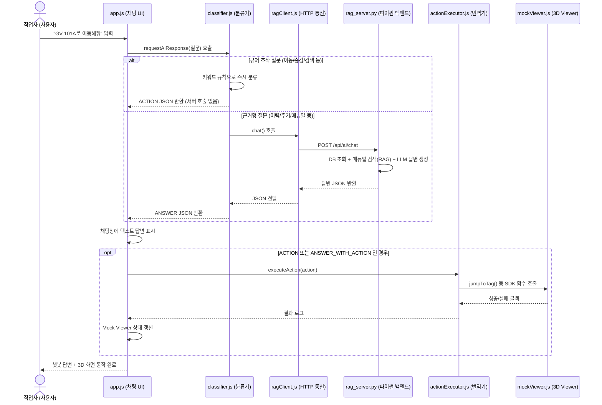
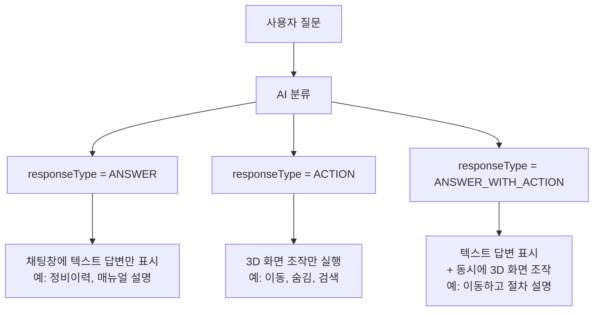
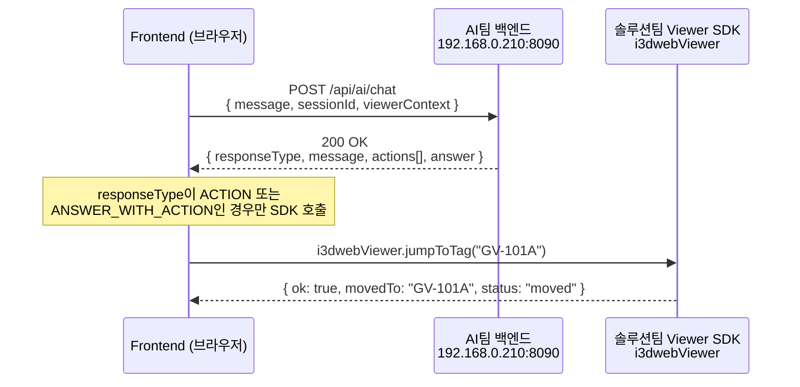
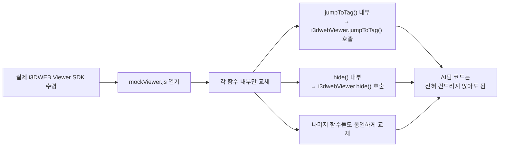

# i3DWEB AI 연동 프로젝트

> 이 문서는 프로젝트에  전체 그림을 빠르게 파악할 수 있도록
> 프로젝트 목적, 팀 역할 분담, 기술 구조, 현재 구현 현황, 확장 방향을 한 곳에 정리한 문서입니다.

---

## 1. 한 줄 요약

> **"복잡한 산업 플랜트 현장에서, 작업자가 말로 물어보면 AI가 답하고 3D 화면이 움직이는 대화형 유지보수 어시스턴트"**

---

## 2. 프로젝트 배경 & 주제

### 어떤 문제를 해결하려는가?

플랜트·발전소 같은 거대한 산업 현장에서 정비 작업자는 매일 이런 불편을 겪습니다.

- 밸브 하나를 점검하려면 **정비이력 시스템(CMMS)**, **절차 매뉴얼**, **3D 도면** 세 가지를 각각 열어야 함
- 수백 페이지짜리 PDF 절차서에서 원하는 항목을 직접 찾아야 함
- 3D 화면에서 특정 설비가 어디 있는지 육안으로 찾아야 함

### 해결 방향

| 기존 방식                           | 이 프로젝트 이후                       |
| ----------------------------------- | -------------------------------------- |
| 시스템 3개를 각각 로그인해서 확인   | 채팅창 하나에 자연어로 질문            |
| 직접 매뉴얼 검색 (수백 페이지 탐색) | AI가 근거 출처와 함께 즉시 답변        |
| 3D 화면에서 육안으로 설비 탐색      | "이동해줘"라고 말하면 화면이 자동 이동 |
| 이력/주기/매뉴얼 각각 별도 조회     | 한 번의 질문으로 통합 브리핑           |

## 3. 두 팀의 역할 분담

### 팀 역할 한눈에 보기

```mermaid
graph LR
    subgraph AI["AI팀 담당"]
        A1["backend/rag_server.py<br/>LLM + RAG 서버"]
        A2["src/ai/classifier.js<br/>자연어 분류기"]
        A3["src/ai/ragClient.js<br/>HTTP 통신"]
        A4["src/ai/maintenanceDb.js<br/>정비이력 Mock DB"]
        A5["src/ai/workflowDb.js<br/>작업오더 Mock DB"]
    end

    subgraph SOL["솔루션팀 담당"]
        S1["src/viewer/mockViewer.js<br/>3D Viewer SDK"]
        S2["src/viewer/spatialDb.js<br/>공간 데이터 DB"]
    end

    subgraph COMMON["공통 영역 (두 팀 연결)"]
        C1["src/core/actionExecutor.js<br/>액션 실행기 (번역기)"]
        C2["src/ui/app.js<br/>채팅 UI / 오케스트레이터"]
    end

    AI -- "JSON 명령 전달" --> COMMON
    COMMON -- "SDK 호출" --> SOL
```



### 파일별 담당 팀 전체 목록

| 파일 경로                      | 담당 팀  | 역할 요약                                        |
| ------------------------------ | -------- | ------------------------------------------------ |
| `backend/rag_server.py`      | AI팀     | LLM + RAG + DB를 결합해 최종 답변 JSON 생성      |
| `src/ai/classifier.js`       | AI팀     | 사용자 입력을 분석해 어느 경로로 보낼지 결정     |
| `src/ai/ragClient.js`        | AI팀     | 프론트 → 파이썬 서버 HTTP 통신 담당             |
| `src/ai/maintenanceDb.js`    | AI팀     | 정비이력·주기(CMMS) 모의 데이터                 |
| `src/ai/workflowDb.js`       | AI팀     | 작업오더(WO) 진행 단계 모의 데이터               |
| `data/manual_index.npy`      | AI팀     | bge-m3 임베딩으로 만든 절차서 검색 인덱스        |
| `src/viewer/mockViewer.js`   | 솔루션팀 | `jumpToTag()`, `hide()` 등 3D 화면 조작 구현 |
| `src/viewer/spatialDb.js`    | 솔루션팀 | 설비 높이, 추락위험 등 Walkinside 공간 정보      |
| `src/core/actionExecutor.js` | 공통     | AI JSON 명령을 Viewer SDK 함수로 변환            |
| `src/ui/app.js`              | 공통     | 채팅창 UI 관리, 응답 렌더링, 전체 흐름 조율      |
| `src/ui/styles.css`          | 공통     | 화면 스타일                                      |
| `index.html`                 | 공통     | 화면 골격, 모듈 로드 진입점                      |

> **솔루션팀 핵심 역할:** 실제 i3DWEB Viewer SDK가 나오면 `mockViewer.js` 안 함수만 교체하면 됩니다. 나머지 AI 코드는 바꾸지 않아도 됩니다.

---

## 4. 전체 동작 흐름

### 사용자 입력 → 최종 응답까지 전체 흐름



### 핵심 설계 원칙: AI와 Viewer는 JSON으로만 대화한다

```
[나쁜 구조] AI가 직접 Viewer API 호출  →  Viewer가 바뀌면 AI도 전부 수정해야 함
[좋은 구조] AI는 JSON만 생성  →  actionExecutor가 JSON 보고 Viewer 호출

   AI팀        공통 영역              솔루션팀
+---------+  +--------------+  +------------------+
|  JSON   |  | action       |  | 실제 Viewer SDK  |
|  생성   | →| Executor     | →| jumpToTag()      |
|         |  | (번역기)     |  | hide() 등        |
+---------+  +--------------+  +------------------+
```

이 덕분에 실제 Viewer SDK가 바뀌어도 `mockViewer.js` 내부만 교체하면 됩니다.

---

## 5. 핵심 개념: responseType과 Action JSON

### 5-1. responseType — AI 응답의 3가지 유형

AI가 모든 응답에 `responseType`을 붙여 반환합니다. 프론트는 이 값으로 다음 동작을 결정합니다.



| responseType           | 의미                  | 예시 입력                     | 결과                             |
| ---------------------- | --------------------- | ----------------------------- | -------------------------------- |
| `ANSWER`             | 챗봇 텍스트 답변만    | "GV-101A가 어떤 설비야?"      | 설명 텍스트 출력, 화면 변화 없음 |
| `ACTION`             | 3D 화면 조작만        | "GV-101A로 이동해줘"          | 답변 없이 화면만 이동            |
| `ANSWER_WITH_ACTION` | 답변 + 화면 조작 동시 | "이동하고 점검 절차도 알려줘" | 텍스트 답변 + 화면 이동          |

### 5-2. 공통 응답 JSON 형식

AI 백엔드가 항상 이 형태로 응답을 반환합니다.

```json
{
  "responseType": "ACTION",
  "message": "GV-101A 위치로 이동합니다.",
  "answer": null,
  "actions": [
    {
      "type": "JUMP_TO",
      "targetType": "TAG",
      "targetValue": "GV-101A",
      "params": {}
    }
  ],
  "confidence": 0.95
}
```

| 필드             | 설명                              | 예시                                     |
| ---------------- | --------------------------------- | ---------------------------------------- |
| `responseType` | 응답 유형 구분                    | `"ACTION"`                             |
| `message`      | 채팅창에 보여줄 짧은 안내 문구    | `"GV-101A 위치로 이동합니다."`         |
| `answer`       | 실제 답변 내용 (ACTION일 때 null) | `"정비 주기가 95일 초과되었습니다..."` |
| `actions`      | 3D 뷰어가 실행할 명령 목록 (배열) | `[{type:"JUMP_TO", ...}]`              |
| `confidence`   | AI 판단 확신도 (디버깅용)         | `0.95`                                 |

### 5-3. 구현가능한 Action 타입 (현재 구현 완료,솔루션팀과 상의해야함)

| Action 타입               | 동작 설명               | 예시 입력                      |
| ------------------------- | ----------------------- | ------------------------------ |
| `JUMP_TO`               | 태그 위치로 화면 이동   | "GV-101A로 이동해줘"           |
| `SEARCH_EQUIPMENT`      | 이름/타입으로 설비 검색 | "펌프 찾아줘"                  |
| `ROTATE_VIEW`           | 시점 회전 (뒷면/측면)   | "뒷면 보여줘"                  |
| `HIDE_OBJECT`           | 특정 설비/타입 숨김     | "밸브 안 보이게 꺼줘"          |
| `SHOW_OBJECT`           | 숨긴 설비 다시 표시     | "밸브 다시 보여줘"             |
| `ISOLATE_SYSTEM`        | 특정 계통만 표시        | "냉각수 계통만 보여줘"         |
| `FILTER_BY_TYPE`        | 특정 타입만 표시        | "펌프만 보여줘"                |
| `MOVE_TO_INSPECTION`    | 점검 위치로 이동        | "이 설비 점검 위치로 이동해줘" |
| `SHOW_PATH`             | 경로 표시               | "비상 탈출 경로 보여줘"        |
| `SHOW_INSPECTION_ROUTE` | 오늘 점검 순서 안내     | "오늘 점검 순서 안내해줘"      |
| `FIND_NEAREST`          | 가장 가까운 점검 대상   | "가까운 점검 대상 보여줘"      |
| `SHOW_WORKER_POSITION`  | 점검자 위치 표시        | "작업자 서야 할 위치 보여줘"   |
| `SHOW_WORK_ZONE`        | 정비 작업 구역 표시     | "정비 구역 표시해줘"           |

---

## 7. 현재 구현된 기능 & 실제 사용 프롬프트 요약

> 모든 기능은 `index.html`을 브라우저에서 열면 바로 테스트할 수 있습니다.
> 기본 대상 설비는 **GV-101A** (글로브 밸브)이며, 채팅창에 아래 프롬프트를 그대로 입력해 보세요.

### 1. 3D 화면 조작 (뷰어 ACTION) — 브라우저 단독 동작

서버 없이도 동작하며, 채팅창 입력 시 즉시 Mock Viewer 화면과 상태가 변경됩니다.

| 구분                     | 대표 프롬프트 예시                                                                                       | 실행 Action                                                        | 동작 결과                                               |
| ------------------------ | -------------------------------------------------------------------------------------------------------- | ------------------------------------------------------------------ | ------------------------------------------------------- |
| **화면 이동**      | `GV-101A로 이동해줘TG-BRG-002 위치로 안내해줘`                                                         | `JUMP_TO`                                                        | 해당 설비 좌표로 카메라 이동 및 강조                    |
| **설비 검색**      | `터빈 윤활유 펌프 찾아줘밸브 검색해줘`                                                                 | `SEARCH_EQUIPMENT`                                               | 해당 조건 설비 목록 강조 및 이동                        |
| **시점 회전**      | `이 장비 뒷면 보여줘측면으로 돌려줘`                                                                   | `ROTATE_VIEW`                                                    | 시점 180도(후면) 또는 90도(측면) 회전                   |
| **객체 숨김/표시** | `밸브가 안 보이게 꺼줘밸브 다시 보여줘``전체 다시 보여줘`                                              | `HIDE_OBJECTSHOW_OBJECT`                                         | 특정 타입/태그 숨김 처리 및 다시 표시 복원              |
| **필터 및 격리**   | `펌프만 보여줘냉각수 계통만 보여줘`                                                                    | `FILTER_BY_TYPEISOLATE_SYSTEM`                                   | 선택한 타입 또는 계통 설비만 남기고 나머지 격리         |
| **위치/경로 안내** | `이 설비 점검 위치로 이동해줘비상 탈출 경로 보여줘``오늘 점검 동선 알려줘가장 가까운 점검 대상 보여줘` | `MOVE_TO_INSPECTIONSHOW_PATH``SHOW_INSPECTION_ROUTEFIND_NEAREST` | 작업자 위치 이동, 비상구 경로(35m), 최적 점검 동선 표시 |

---

### 2. 백엔드 데이터 질의 (ANSWER / RAG) — 파이썬 서버 통신

파이썬 백엔드(`rag_server.py`) 가동 시 실제 DB 사실 및 매뉴얼 근거 기반으로 답변합니다.

| 기능 카테고리               | 대표 프롬프트 예시                                                                                                                          | 핵심 반환 내용                                                                         |
| --------------------------- | ------------------------------------------------------------------------------------------------------------------------------------------- | -------------------------------------------------------------------------------------- |
| **정비 이력 (CMMS)**  | `이 밸브의 최근 정비 이력 보여줘마지막으로 언제 분해 정비했어?``보닛 가스켓 교체 이력 있어?등록된 Open Point 있어?`                       | 분해정비일(2025-03-21), 가스켓 교체 1회, 누설 이력 1건, Open Point 1건 등 DB 사실 반환 |
| **정비 주기 (CMMS)**  | `이 밸브의 정비 주기 지났어?다음 정비 예정일이 언제야?``우선 점검해야 할 부품 알려줘`                                                     | 기준 정비 주기(12개월) 대비 동적 초과 판정, 다음 예정일, 우선 점검 부품(그랜드패킹)    |
| **작업 단계 (WO)**    | `지금 이 밸브 정비는 어느 단계까지 완료됐어?분해 전 준비사항 중 완료 안 된 항목 있어?``조립 전 점검사항 중 누락된 항목 있어?`             | 현재 진행 단계, 다음 단계 안내, 분해 전 준비 미완료 사항, 조립 전 누락 체크리스트      |
| **매뉴얼 절차 (RAG)** | `그랜드패킹 교체 어떻게 해?그랜드너트 조임 절차 알려줘``사용한 가스켓 재사용 지침이 어떻게 돼?고소작업 기준 높이가 매뉴얼에 어떻게 나와?` | bge-m3 벡터 검색 + Qwen3 LLM 종합 답변 (근거 매뉴얼 절차서 섹션 및 출처 표기)          |
| **작업 공간 (안전)**  | `이 Globe Valve 주변 작업 공간 충분해?이 밸브는 2m 이상 고소작업에 해당돼?``주변에 추락 위험이나 개구부가 있어?`                          | 전면/우측 작업 반경, 고소작업(~2.3m) 여부 및 안전대 착용 안내, 주변 개구부 추락 위험   |

### 4. 구현 상태 요약

| 구분                       | 구현 상태               | 설명 및 교체 대상                                                               |
| -------------------------- | ----------------------- | ------------------------------------------------------------------------------- |
| **완전 구현 기능**   | 총 44종+ 질의/조작 완료 | 뷰어 Action 13종, 정비이력 7종, 주기 4종, 단계 5종, 매뉴얼 15종+, 공간 5종      |
| **Mock 데이터 영역** | 로컬 Mock 연동 중       | 실제 배포 시`mockViewer.js` → i3DWEB SDK, `app.db` → 실 CMMS/WO DB로 교체 |
| **향후 고도화 예정** | 미구현                  | 스트리밍 응답(SSE), 멀티턴 대용어("그거"), 비전 AI 사진 분석, 예지보전          |

## 9. 팀 간 통신 계약

두 팀이 공유하는 인터페이스는 두 가지입니다. 이 계약이 지켜지면 각 팀은 독립적으로 개발할 수 있습니다.

### 통신 구조 한눈에 보기



### 9-1. AI팀 HTTP API 명세

**요청 (Frontend → AI 백엔드)**

```
POST http://192.168.0.210:8090/api/ai/chat
Content-Type: application/json

{
  "sessionId": "sess-ab12cd",
  "message": "GV-101A로 이동해줘",
  "viewerContext": { "currentTag": "GV-101A" }
}
```

| 요청 필드                    | 타입          | 설명                              |
| ---------------------------- | ------------- | --------------------------------- |
| `sessionId`                | string        | 대화 세션 ID (대화이력 유지용)    |
| `message`                  | string        | 사용자가 입력한 자연어 문장       |
| `viewerContext.currentTag` | string\| null | 현재 3D 화면에서 선택된 설비 태그 |

**응답 (AI 백엔드 → Frontend)**

```json
{
  "responseType": "ACTION",
  "message": "GV-101A 위치로 이동합니다.",
  "answer": null,
  "actions": [
    { "type": "JUMP_TO", "targetType": "TAG", "targetValue": "GV-101A", "params": {} }
  ],
  "confidence": 0.95
}
```

### 9-2. 솔루션팀 Viewer SDK 계약

**Frontend → Viewer 호출**

```javascript
i3dwebViewer.jumpToTag("GV-101A");
```

**Viewer → Frontend 콜백 (성공)**

```json
{ "ok": true, "movedTo": "GV-101A", "status": "moved" }
```

**Viewer → Frontend 콜백 (실패)**

```json
{ "ok": false, "error": "TAG_NOT_FOUND", "message": "GV-XXX-999 태그를 찾을 수 없습니다." }
```

### 에러 코드 정의

| 에러 코드              | 발생 구간               | 담당 팀  | 의미                           |
| ---------------------- | ----------------------- | -------- | ------------------------------ |
| `INTERNAL_ERROR`     | AI 백엔드 HTTP 500 응답 | AI팀     | AI 답변 생성 실패              |
| `TAG_NOT_FOUND`      | Viewer SDK 콜백         | 솔루션팀 | Viewer에 해당 태그가 없음      |
| `UNSUPPORTED_ACTION` | Frontend actionExecutor | 공통     | 정의되지 않은 action type 수신 |

---

## 11. 각 팀이 코드 작업할 때 건드릴 파일

### AI팀 작업 영역

| 하고 싶은 작업               | 건드릴 파일                 | 구체적인 위치                                   |
| ---------------------------- | --------------------------- | ----------------------------------------------- |
| 새 질문 카테고리/키워드 추가 | `src/ai/classifier.js`    | `classifyRuleBased()` 함수                    |
| 백엔드 LLM 답변 내용 개선    | `backend/rag_server.py`   | `make_chat()` 함수                            |
| 의도 분류 로직 개선          | `backend/rag_server.py`   | `resolve_intent()` 함수                       |
| 새 매뉴얼 PDF 추가           | `유지보수메뉴얼/` 폴더    | PDF 추가 후`scripts/ingest_manuals.py` 재실행 |
| 정비 Mock 데이터 수정        | `src/ai/maintenanceDb.js` | 파일 직접 수정                                  |
| 작업오더 Mock 데이터 수정    | `src/ai/workflowDb.js`    | 파일 직접 수정                                  |

### 솔루션팀 작업 영역

| 하고 싶은 작업            | 건드릴 파일                                                   | 구체적인 위치                          |
| ------------------------- | ------------------------------------------------------------- | -------------------------------------- |
| 실제 Viewer SDK 연동      | `src/viewer/mockViewer.js`                                  | 각 함수 내부만 교체 (`jumpToTag` 등) |
| 새 SDK 함수 추가          | `src/viewer/mockViewer.js` + `src/core/actionExecutor.js` | mock 함수 추가 + register 한 줄 추가   |
| 공간 데이터 실데이터 연동 | `src/viewer/spatialDb.js`                                   | 파일 직접 수정                         |

### 공통 작업 영역

| 하고 싶은 작업          | 건드릴 파일                              | 구체적인 위치                                       |
| ----------------------- | ---------------------------------------- | --------------------------------------------------- |
| 새 Action 타입 추가     | `src/core/actionExecutor.js`           | `ActionExecutor.register("새타입", handler)` 추가 |
| UI / 화면 레이아웃 변경 | `src/ui/app.js`, `src/ui/styles.css` | 렌더링 함수 수정                                    |

### 실제 Viewer SDK 연동 시 교체 흐름



---

---

*문서 최종 업데이트: 2026-06-30 | 작성: AI팀 (김린)*
