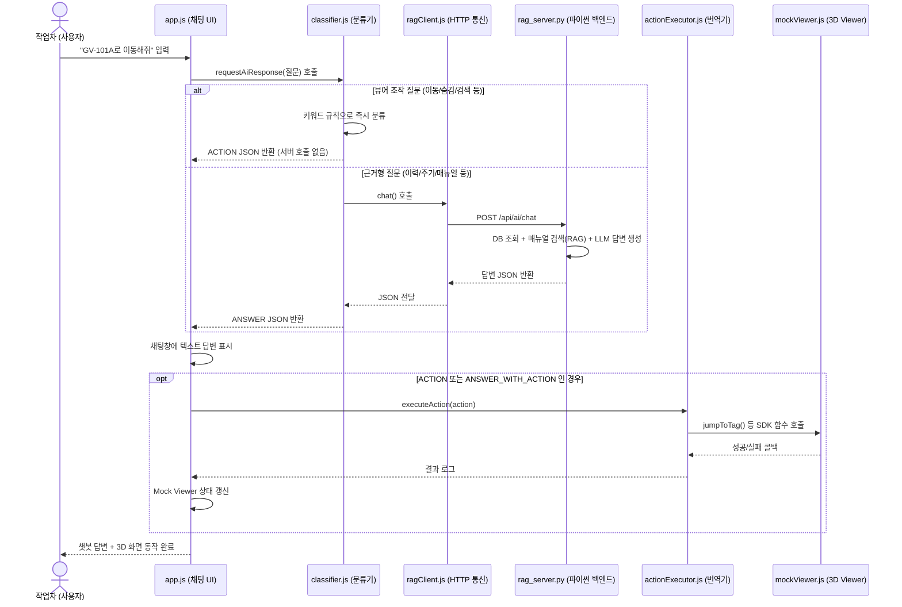
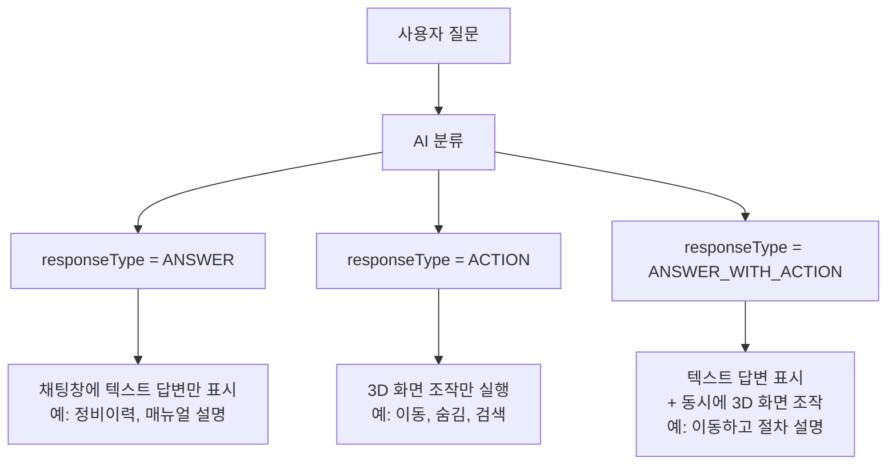
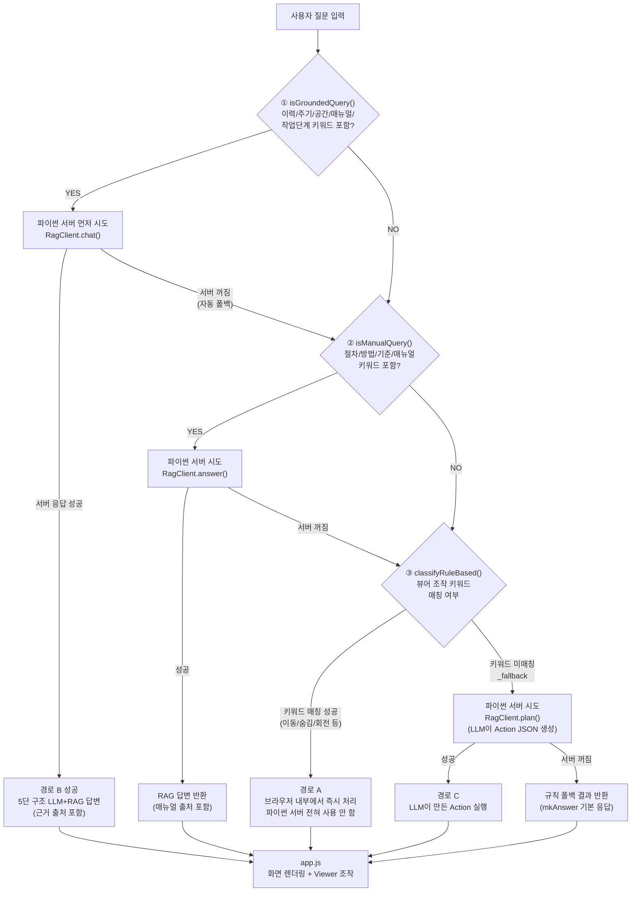
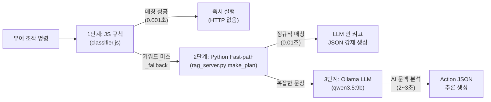
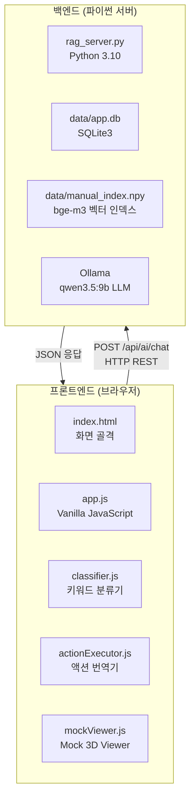
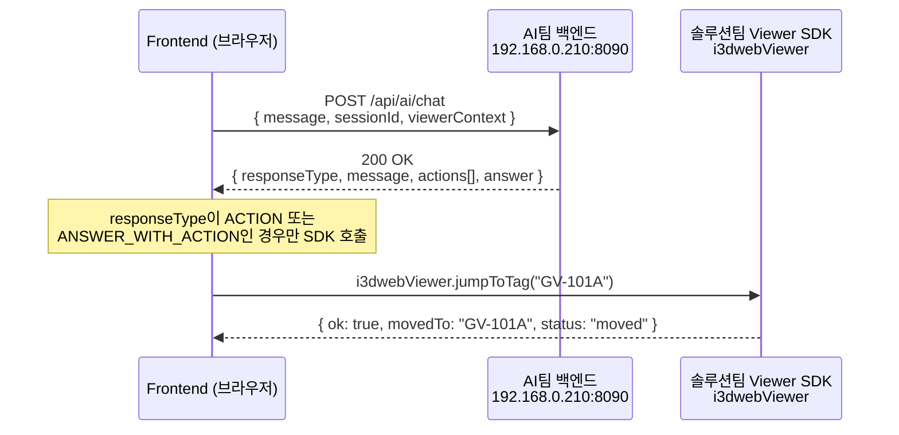
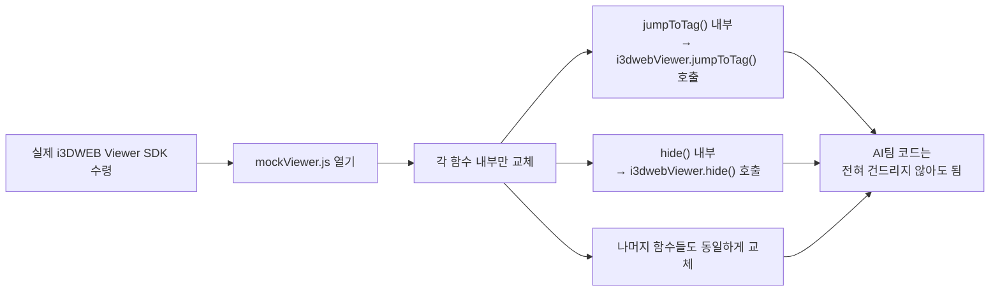

# i3DWEB AI 연동 프로젝트

> 이 문서는 프로젝트에 새로 합류하는 팀원이 전체 그림을 빠르게 파악할 수 있도록
> 프로젝트 목적, 팀 역할 분담, 기술 구조, 현재 구현 현황, 확장 방향을 한 곳에 정리한 문서입니다.

---

## 목차

1. [한 줄 요약](#1-한-줄-요약)
2. [프로젝트 배경 &amp; 주제](#2-프로젝트-배경--주제)
3. [두 팀의 역할 분담](#3-두-팀의-역할-분담)
4. [전체 동작 흐름](#4-전체-동작-흐름)
5. [핵심 개념: responseType과 Action JSON](#5-핵심-개념-responsetype과-action-json)
6. [AI 답변의 두 가지 경로](#6-ai-답변의-두-가지-경로)
7. [현재 구현된 기능 &amp; 구현 수준](#7-현재-구현된-기능--구현-수준)
8. [기술 스택](#8-기술-스택)
9. [팀 간 통신 계약](#9-팀-간-통신-계약)
10. [프로젝트 실행 방법](#10-프로젝트-실행-방법)
11. [각 팀이 코드 작업할 때 건드릴 파일](#11-각-팀이-코드-작업할-때-건드릴-파일)
12. [향후 발전 로드맵](#12-향후-발전-로드맵)
13. [핵심 문서 목록](#13-핵심-문서-목록)
14. [자주 묻는 질문 (FAQ)](#14-자주-묻는-질문-faq)

---

## 1. 한 줄 요약

> **"복잡한 산업 플랜트 현장에서, 작업자가 말로 물어보면 AI가 답하고 3D 화면이 움직이는 대화형 유지보수 어시스턴트"**

---

## 2. 프로젝트 배경 & 주제

### 어떤 문제를 해결하려는가?

플랜트·발전소 같은 거대한 산업 현장에서 정비 작업자는 매일 이런 불편을 겪습니다.

- 밸브 하나를 점검하려면 **정비이력 시스템(CMMS)**, **절차 매뉴얼**, **3D 도면** 세 가지를 각각 열어야 함
- 수백 페이지짜리 PDF 절차서에서 원하는 항목을 직접 찾아야 함
- 3D 화면에서 특정 설비가 어디 있는지 육안으로 찾아야 함

### 해결 방향

| 기존 방식                           | 이 프로젝트 이후                       |
| ----------------------------------- | -------------------------------------- |
| 시스템 3개를 각각 로그인해서 확인   | 채팅창 하나에 자연어로 질문            |
| 직접 매뉴얼 검색 (수백 페이지 탐색) | AI가 근거 출처와 함께 즉시 답변        |
| 3D 화면에서 육안으로 설비 탐색      | "이동해줘"라고 말하면 화면이 자동 이동 |
| 이력/주기/매뉴얼 각각 별도 조회     | 한 번의 질문으로 통합 브리핑           |

## 3. 두 팀의 역할 분담

### 팀 역할 한눈에 보기

```mermaid
graph LR
    subgraph AI["AI팀 담당"]
        A1["backend/rag_server.py<br/>LLM + RAG 서버"]
        A2["src/ai/classifier.js<br/>자연어 분류기"]
        A3["src/ai/ragClient.js<br/>HTTP 통신"]
        A4["src/ai/maintenanceDb.js<br/>정비이력 Mock DB"]
        A5["src/ai/workflowDb.js<br/>작업오더 Mock DB"]
    end

    subgraph SOL["솔루션팀 담당"]
        S1["src/viewer/mockViewer.js<br/>3D Viewer SDK"]
        S2["src/viewer/spatialDb.js<br/>공간 데이터 DB"]
    end

    subgraph COMMON["공통 영역 (두 팀 연결)"]
        C1["src/core/actionExecutor.js<br/>액션 실행기 (번역기)"]
        C2["src/ui/app.js<br/>채팅 UI / 오케스트레이터"]
    end

    AI -- "JSON 명령 전달" --> COMMON
    COMMON -- "SDK 호출" --> SOL
```



### 파일별 담당 팀 전체 목록

| 파일 경로                      | 담당 팀  | 역할 요약                                        |
| ------------------------------ | -------- | ------------------------------------------------ |
| `backend/rag_server.py`      | AI팀     | LLM + RAG + DB를 결합해 최종 답변 JSON 생성      |
| `src/ai/classifier.js`       | AI팀     | 사용자 입력을 분석해 어느 경로로 보낼지 결정     |
| `src/ai/ragClient.js`        | AI팀     | 프론트 → 파이썬 서버 HTTP 통신 담당             |
| `src/ai/maintenanceDb.js`    | AI팀     | 정비이력·주기(CMMS) 모의 데이터                 |
| `src/ai/workflowDb.js`       | AI팀     | 작업오더(WO) 진행 단계 모의 데이터               |
| `data/manual_index.npy`      | AI팀     | bge-m3 임베딩으로 만든 절차서 검색 인덱스        |
| `src/viewer/mockViewer.js`   | 솔루션팀 | `jumpToTag()`, `hide()` 등 3D 화면 조작 구현 |
| `src/viewer/spatialDb.js`    | 솔루션팀 | 설비 높이, 추락위험 등 Walkinside 공간 정보      |
| `src/core/actionExecutor.js` | 공통     | AI JSON 명령을 Viewer SDK 함수로 변환            |
| `src/ui/app.js`              | 공통     | 채팅창 UI 관리, 응답 렌더링, 전체 흐름 조율      |
| `src/ui/styles.css`          | 공통     | 화면 스타일                                      |
| `index.html`                 | 공통     | 화면 골격, 모듈 로드 진입점                      |

> **솔루션팀 핵심 역할:** 실제 i3DWEB Viewer SDK가 나오면 `mockViewer.js` 안 함수만 교체하면 됩니다. 나머지 AI 코드는 바꾸지 않아도 됩니다.

---

## 4. 전체 동작 흐름

### 사용자 입력 → 최종 응답까지 전체 흐름



### 핵심 설계 원칙: AI와 Viewer는 JSON으로만 대화한다

```
[나쁜 구조] AI가 직접 Viewer API 호출  →  Viewer가 바뀌면 AI도 전부 수정해야 함
[좋은 구조] AI는 JSON만 생성  →  actionExecutor가 JSON 보고 Viewer 호출

   AI팀        공통 영역              솔루션팀
+---------+  +--------------+  +------------------+
|  JSON   |  | action       |  | 실제 Viewer SDK  |
|  생성   | →| Executor     | →| jumpToTag()      |
|         |  | (번역기)     |  | hide() 등        |
+---------+  +--------------+  +------------------+
```

이 덕분에 실제 Viewer SDK가 바뀌어도 `mockViewer.js` 내부만 교체하면 됩니다.

---

## 5. 핵심 개념: responseType과 Action JSON

### 5-1. responseType — AI 응답의 3가지 유형

AI가 모든 응답에 `responseType`을 붙여 반환합니다. 프론트는 이 값으로 다음 동작을 결정합니다.



| responseType           | 의미                  | 예시 입력                     | 결과                             |
| ---------------------- | --------------------- | ----------------------------- | -------------------------------- |
| `ANSWER`             | 챗봇 텍스트 답변만    | "GV-101A가 어떤 설비야?"      | 설명 텍스트 출력, 화면 변화 없음 |
| `ACTION`             | 3D 화면 조작만        | "GV-101A로 이동해줘"          | 답변 없이 화면만 이동            |
| `ANSWER_WITH_ACTION` | 답변 + 화면 조작 동시 | "이동하고 점검 절차도 알려줘" | 텍스트 답변 + 화면 이동          |

### 5-2. 공통 응답 JSON 형식

AI 백엔드가 항상 이 형태로 응답을 반환합니다.

```json
{
  "responseType": "ACTION",
  "message": "GV-101A 위치로 이동합니다.",
  "answer": null,
  "actions": [
    {
      "type": "JUMP_TO",
      "targetType": "TAG",
      "targetValue": "GV-101A",
      "params": {}
    }
  ],
  "confidence": 0.95
}
```

| 필드             | 설명                              | 예시                                     |
| ---------------- | --------------------------------- | ---------------------------------------- |
| `responseType` | 응답 유형 구분                    | `"ACTION"`                             |
| `message`      | 채팅창에 보여줄 짧은 안내 문구    | `"GV-101A 위치로 이동합니다."`         |
| `answer`       | 실제 답변 내용 (ACTION일 때 null) | `"정비 주기가 95일 초과되었습니다..."` |
| `actions`      | 3D 뷰어가 실행할 명령 목록 (배열) | `[{type:"JUMP_TO", ...}]`              |
| `confidence`   | AI 판단 확신도 (디버깅용)         | `0.95`                                 |

### 5-3. 구현가능한 Action 타입 (현재 구현 완료,솔루션팀과 상의해야함)

| Action 타입               | 동작 설명               | 예시 입력                      | 호출되는 SDK 함수           |
| ------------------------- | ----------------------- | ------------------------------ | --------------------------- |
| `JUMP_TO`               | 태그 위치로 화면 이동   | "GV-101A로 이동해줘"           | `jumpToTag(tag)`          |
| `SEARCH_EQUIPMENT`      | 이름/타입으로 설비 검색 | "펌프 찾아줘"                  | `searchEquipment(query)`  |
| `ROTATE_VIEW`           | 시점 회전 (뒷면/측면)   | "뒷면 보여줘"                  | `rotateView(dir, angle)`  |
| `HIDE_OBJECT`           | 특정 설비/타입 숨김     | "밸브 안 보이게 꺼줘"          | `hide({by, value})`       |
| `SHOW_OBJECT`           | 숨긴 설비 다시 표시     | "밸브 다시 보여줘"             | `show({by, value})`       |
| `ISOLATE_SYSTEM`        | 특정 계통만 표시        | "냉각수 계통만 보여줘"         | `isolateSystem(system)`   |
| `FILTER_BY_TYPE`        | 특정 타입만 표시        | "펌프만 보여줘"                | `filterByType(type)`      |
| `MOVE_TO_INSPECTION`    | 점검 위치로 이동        | "이 설비 점검 위치로 이동해줘" | `moveToInspection(tag)`   |
| `SHOW_PATH`             | 경로 표시               | "비상 탈출 경로 보여줘"        | `showPath(target)`        |
| `SHOW_INSPECTION_ROUTE` | 오늘 점검 순서 안내     | "오늘 점검 순서 안내해줘"      | `showInspectionRoute()`   |
| `FIND_NEAREST`          | 가장 가까운 점검 대상   | "가까운 점검 대상 보여줘"      | `findNearest()`           |
| `SHOW_WORKER_POSITION`  | 점검자 위치 표시        | "작업자 서야 할 위치 보여줘"   | `showWorkerPosition(tag)` |
| `SHOW_WORK_ZONE`        | 정비 작업 구역 표시     | "정비 구역 표시해줘"           | `showWorkZone(tag)`       |

---

## 6. AI 답변의 두 가지 경로

사용자 질문은 성격에 따라 두 갈래 중 하나로 처리됩니다.

### 경로 분류 흐름도

> 실제 코드(`classifier.js` `requestAiResponse()`) 기준입니다. 순서가 중요합니다.



### 경로별 비교

| 구분             | 경로 A (브라우저 규칙 기반)                                          | 경로 B (파이썬 LLM+RAG)                              | 경로 C (LLM 폴백)                      |
| ---------------- | -------------------------------------------------------------------- | ---------------------------------------------------- | -------------------------------------- |
| 진입 조건        | isGroundedQuery=NO, isManualQuery=NO,**뷰어 조작 키워드 매칭** | isGroundedQuery=YES (이력/주기/공간/작업단계 키워드) | 위 모두 미매칭 (규칙 _fallback)        |
| 파이썬 서버 사용 | **전혀 없음**                                                  | 사용 (먼저 시도)                                     | 사용 (마지막 시도)                     |
| 서버 꺼졌을 때   | 그대로 정상 동작                                                     | 자동으로 경로 A/C로 폴백                             | 기본 응답(mkAnswer) 반환               |
| 응답 속도        | 즉시 (ms 단위)                                                       | 느림 (LLM 생성 수 초)                                | 느림 (LLM 생성)                        |
| 주요 질문 유형   | 이동/숨김/회전/검색/경로 등 뷰어 조작                                | 정비이력/주기/공간/매뉴얼/작업단계                   | 위 범주에 안 걸리는 자유 입력          |
| 답변 품질        | 결정적 (높음)                                                        | 근거 기반 (높음)                                     | 가변적 (낮을 수 있음)                  |
| 핵심 코드        | `classifyRuleBased()`                                              | `RagClient.chat()` + `make_chat()`               | `RagClient.plan()` + `make_plan()` |

### 파이썬 서버 통신 판단 기준: `isGroundedQuery()` 분기 구조

`classifier.js`는 사용자의 질문이 **"데이터베이스 조회나 매뉴얼 RAG 검색이 필요한 질문인가?"**를 판단하기 위해 내부적으로 `isGroundedQuery()` 함수([`classifier.js:L387`](file:///c:/lyn/i3dweb_mock/src/ai/classifier.js#L387-L389))를 호출합니다. 이 함수는 아래 5가지 하위 검사 함수 중 하나라도 `true`이면 파이썬 백엔드(`RagClient.chat`)로 요청을 보냅니다.

| 판별 함수명 | 질문 카테고리 | 트리거 키워드 목록 |
|---|---|---|
| **`isManualQuery`** | 매뉴얼 / 절차 | `"절차"`, `"방법"`, `"어떻게"`, `"교체 기준"`, `"보수 기준"`, `"점검 기준"`, `"토크"`, `"예비품"`, `"특별점검"`, `"매뉴얼"`, `"지침"`, `"조치 기준"`, `"이상징후"` |
| **`isWorkConditionQuery`** | 작업 공간 / 고소작업 | `"작업 공간"`, `"공간 충분"`, `"공간이"`, `"간섭"`, `"사다"`, `"작업 발판"`, `"작업발판"`, `"발판"`, `"고소작업"`, `"추락"`, `"개구부"`, `"2m 이상"` |
| **`isStageQuery`** | 작업 단계 / 체크리스트 | `"단계"`, `"체크리스트"`, `"다음 작업"`, `"준비사항"`, `"점검사항"`, `"누락"`, `"미완료"`, `"완료 안"` |
| **`isCycleQuery`** | 정비 주기 / 교체 판단 | `"주기"`, `"예정일"`, `"다음 정비"`, `"부품"`, `"교체해야"`, `"할까"`, `"검토"`, `"필요"` |
| **`isMaintenanceQuery`** | 정비 이력 / 누설 / 미조치 | `"이력"`, `"분해 정비"`, `"분해정비"`, `"가스켓"`, `"누설"`, `"고장 유형"`, `"반복"`, `"점검 결과"`, `"정상이"`, `"미조치"`, `"오픈포인트"`, `"open point"`, `"openpoint"` |

> **💡 핵심 작동 로직:** 위 표에 있는 키워드가 포함되면 👉 파이썬 서버에서 실제 DB와 매뉴얼을 조회해 5단 구조(`ANSWER`)로 답변합니다. 만약 포함되어 있지 않고 `"이동"`, `"숨겨"` 같은 단어만 있다면 👉 브라우저 내부 규칙(`ACTION`)으로 즉시 처리됩니다.

### 핵심 정리

```
질문이 들어오면 항상 이 순서로 체크합니다:

  1. "이력/주기/공간/매뉴얼/단계" 키워드가 있으면?
      → 파이썬 서버부터 먼저 시도
      → 서버 꺼져 있으면 다음 단계로 내려옴

  2. 위에 안 걸리면: "뷰어 조작 키워드"가 있으면?
      → 브라우저 내부에서 즉시 처리 (파이썬 전혀 안 씀)

  3. 뭐에도 안 걸리면?
      → 파이썬 LLM에게 위임 (action JSON 생성 요청)
      → 서버 꺼지면 기본 응답 반환

결론: "이동해줘", "숨겨줘", "뒷면 보여줘" 같은
      순수 뷰어 조작 명령만 파이썬을 완전히 안 씁니다.
      정비이력/매뉴얼 관련은 항상 파이썬 서버를 먼저 시도합니다.
```

---

### 왜 뷰어 조작을 파이썬으로 바로 안 보내고 JS에서 먼저 거를까요? (아키텍처 설계 이유)

"어차피 최종 배포 때 파이썬 서버랑 통신할 거면 처음부터 파이썬으로 다 보내면 되지 않나?"라고 생각할 수 있습니다.
하지만 이 프로젝트에서는 **의도적으로 JS 단에서 먼저 거르도록(Mocking Layer)** 설계했습니다. 핵심 이유는 2가지입니다.

#### 1. 솔루션팀(프론트 개발팀)의 독립적인 개발 & 테스트 보장 (협업 배려)

이 프로젝트는 **AI팀(파이썬 백엔드)**과 **솔루션팀(3D 뷰어 프론트엔드)**이 분리되어 작업합니다.
만약 화면 이동(`jumpToTag`) 같은 뷰어 조작 기능까지 무조건 파이썬 서버를 거쳐야만 동작하게 만들면, 솔루션팀 직원은 뷰어 SDK 함수 하나를 테스트할 때마다 **무거운 파이썬 환경과 Ollama LLM을 내 컴퓨터에 설치하고 서버를 켜야만** 합니다. (또는 AI팀 서버가 꺼지면 프론트엔드 개발도 올스톱됩니다.)

> **설계 장점:** 솔루션팀은 파이썬 서버 없이 그냥 `index.html`을 브라우저 열기만 하면 화면 이동·숨김·회전 등 뷰어 기능을 100% 독립적으로 개발하고 테스트할 수 있습니다.

#### 2. 네트워크 오버헤드 방지 및 즉각적인 반응성

3D 화면을 요리조리 회전하고 숨기면서 탐색할 때마다 매번 HTTP 통신으로 사내망 서버를 왕복하면 지연시간이 발생합니다. 명확한 뷰어 명령은 브라우저 내부 메모리에서 즉시 처리(0.001초)하여 네트워크 오류 위험을 없애고 쾌적한 UX를 제공합니다.

---

### 뷰어 조작 명령의 3단계 철통 방어 시스템

뷰어 조작 명령은 속도와 유연성을 모두 잡기 위해 **총 3단계의 거름망**으로 동작합니다.



| 단계            | 처리 위치                       | 방식                                              | 처리 속도         | 특징                                                                  |
| --------------- | ------------------------------- | ------------------------------------------------- | ----------------- | --------------------------------------------------------------------- |
| **1단계** | 브라우저 JS (`classifier.js`) | 키워드 매칭 (`이동`, `가줘`, `안내` + 태그) | **0.001초** | 뻔하고 명확한 명령을 서버 통신 없이 즉시 처리                         |
| **2단계** | 파이썬 백엔드 (`make_plan`)   | 정규식 Fast-path 매칭                             | **0.01초**  | 백엔드로 직접 요청 오거나 JS가 놓친 이동 명령을 LLM 안 켜고 강제 생성 |
| **3단계** | 파이썬 LLM (`Ollama qwen3`)   | AI 문맥 추론 (`"아까 그 밸브로 가자"`)          | **2~3초**   | 규칙으로 잡을 수 없는 복잡한 대명사/맥락을 AI가 최종 해석             |

이처럼 **"쉬운 건 JS/파이썬 코드가 초고속으로 쳐내고, 진짜 어렵고 애매한 말만 LLM한테 시킨다"**는 하이브리드 구조 덕분에 데모의 안정성과 응답 속도를 모두 극대화할 수 있었습니다.

## 7. 현재 구현된 기능 & 실제 사용 프롬프트 요약

> 모든 기능은 `index.html`을 브라우저에서 열면 바로 테스트할 수 있습니다.
> 기본 대상 설비는 **GV-101A** (글로브 밸브)이며, 채팅창에 아래 프롬프트를 그대로 입력해 보세요.

### 1. 3D 화면 조작 (뷰어 ACTION) — 브라우저 단독 동작
서버 없이도 동작하며, 채팅창 입력 시 즉시 Mock Viewer 화면과 상태가 변경됩니다.

| 구분 | 대표 프롬프트 예시 | 실행 Action | 동작 결과 |
|---|---|---|---|
| **화면 이동** | `GV-101A로 이동해줘`<br/>`TG-BRG-002 위치로 안내해줘` | `JUMP_TO` | 해당 설비 좌표로 카메라 이동 및 강조 |
| **설비 검색** | `터빈 윤활유 펌프 찾아줘`<br/>`밸브 검색해줘` | `SEARCH_EQUIPMENT` | 해당 조건 설비 목록 강조 및 이동 |
| **시점 회전** | `이 장비 뒷면 보여줘`<br/>`측면으로 돌려줘` | `ROTATE_VIEW` | 시점 180도(후면) 또는 90도(측면) 회전 |
| **객체 숨김/표시** | `밸브가 안 보이게 꺼줘`<br/>`밸브 다시 보여줘`<br/>`전체 다시 보여줘` | `HIDE_OBJECT`<br/>`SHOW_OBJECT` | 특정 타입/태그 숨김 처리 및 다시 표시 복원 |
| **필터 및 격리** | `펌프만 보여줘`<br/>`냉각수 계통만 보여줘` | `FILTER_BY_TYPE`<br/>`ISOLATE_SYSTEM` | 선택한 타입 또는 계통 설비만 남기고 나머지 격리 |
| **위치/경로 안내** | `이 설비 점검 위치로 이동해줘`<br/>`비상 탈출 경로 보여줘`<br/>`오늘 점검 동선 알려줘`<br/>`가장 가까운 점검 대상 보여줘` | `MOVE_TO_INSPECTION`<br/>`SHOW_PATH`<br/>`SHOW_INSPECTION_ROUTE`<br/>`FIND_NEAREST` | 작업자 위치 이동, 비상구 경로(35m), 최적 점검 동선 표시 |

---

### 2. 백엔드 데이터 질의 (ANSWER / RAG) — 파이썬 서버 통신
파이썬 백엔드(`rag_server.py`) 가동 시 실제 DB 사실 및 매뉴얼 근거 기반으로 답변합니다.

| 기능 카테고리 | 대표 프롬프트 예시 | 핵심 반환 내용 |
|---|---|---|
| **정비 이력 (CMMS)** | `이 밸브의 최근 정비 이력 보여줘`<br/>`마지막으로 언제 분해 정비했어?`<br/>`보닛 가스켓 교체 이력 있어?`<br/>`등록된 Open Point 있어?` | 분해정비일(2025-03-21), 가스켓 교체 1회, 누설 이력 1건, Open Point 1건 등 DB 사실 반환 |
| **정비 주기 (CMMS)** | `이 밸브의 정비 주기 지났어?`<br/>`다음 정비 예정일이 언제야?`<br/>`우선 점검해야 할 부품 알려줘` | 기준 정비 주기(12개월) 대비 동적 초과 판정, 다음 예정일, 우선 점검 부품(그랜드패킹) |
| **작업 단계 (WO)** | `지금 이 밸브 정비는 어느 단계까지 완료됐어?`<br/>`분해 전 준비사항 중 완료 안 된 항목 있어?`<br/>`조립 전 점검사항 중 누락된 항목 있어?` | 현재 진행 단계, 다음 단계 안내, 분해 전 준비 미완료 사항, 조립 전 누락 체크리스트 |
| **매뉴얼 절차 (RAG)** | `그랜드패킹 교체 어떻게 해?`<br/>`그랜드너트 조임 절차 알려줘`<br/>`사용한 가스켓 재사용 지침이 어떻게 돼?`<br/>`고소작업 기준 높이가 매뉴얼에 어떻게 나와?` | bge-m3 벡터 검색 + Qwen3 LLM 종합 답변 (근거 매뉴얼 절차서 섹션 및 출처 표기) |
| **작업 공간 (안전)** | `이 Globe Valve 주변 작업 공간 충분해?`<br/>`이 밸브는 2m 이상 고소작업에 해당돼?`<br/>`주변에 추락 위험이나 개구부가 있어?` | 전면/우측 작업 반경, 고소작업(~2.3m) 여부 및 안전대 착용 안내, 주변 개구부 추락 위험 |

---

### 3. 프롬프트 입력 시 주의점 (분기 키워드)
비슷한 질문이어도 특정 키워드 유무에 따라 처리 경로와 결과가 달라집니다.

| 비교 입력 A | 비교 입력 B | 분기 결정 핵심 키워드 |
|---|---|---|
| `TG-PMP-101 찾아줘` → `JUMP_TO` | `펌프 찾아줘` → `SEARCH_EQUIPMENT` | **태그 번호** 명시 여부 |
| `펌프만 보여줘` → `FILTER_BY_TYPE` | `이 계통만 보여줘` → `ISOLATE_SYSTEM` | **"계통"** 단어 유무 |
| `밸브 다시 보여줘` → `SHOW_OBJECT` | `밸브 안 보이게 꺼줘` → `HIDE_OBJECT` | **"다시"** 단어 유무 |
| `글로브밸브 점검 기준 알려줘` → 매뉴얼 `RAG` | `점검 체크리스트 보여줘` → 작업오더 `WO` | **"기준/절차"** vs **"체크리스트/단계"** |

---

### 4. 구현 상태 요약

| 구분 | 구현 상태 | 설명 및 교체 대상 |
|---|---|---|
| **완전 구현 기능** | 총 44종+ 질의/조작 완료 | 뷰어 Action 13종, 정비이력 7종, 주기 4종, 단계 5종, 매뉴얼 15종+, 공간 5종 |
| **Mock 데이터 영역** | 로컬 Mock 연동 중 | 실제 배포 시 `mockViewer.js` → i3DWEB SDK, `app.db` → 실 CMMS/WO DB로 교체 |
| **향후 고도화 예정** | 미구현 | 스트리밍 응답(SSE), 멀티턴 대용어("그거"), 비전 AI 사진 분석, 예지보전 |

---

## 8. 기술 스택



| 레이어            | 사용 기술                               | 역할                                 |
| ----------------- | --------------------------------------- | ------------------------------------ |
| 프론트엔드        | Vanilla HTML / JavaScript / CSS         | 채팅 UI, 흐름 패널, Mock Viewer      |
| 자연어 분류       | JavaScript (규칙 기반 키워드)           | 빠른 뷰어 조작 명령 처리             |
| AI 백엔드 서버    | Python 3.10 (표준 라이브러리)           | HTTP API 서버                        |
| 임베딩 모델       | `BAAI/bge-m3` (sentence-transformers) | 매뉴얼 PDF 벡터 검색                 |
| 로컬 LLM          | Ollama +`qwen3.5:9b`                  | 답변 문장 생성, 의도 분류            |
| 벡터 저장소       | NumPy`.npy` (자체 구현)               | 매뉴얼 청크 임베딩 저장/검색         |
| 정형 데이터베이스 | SQLite3                                 | 정비이력, 작업오더 데이터            |
| AI 서버 주소      | `http://192.168.0.210:8090`           | AI팀 데스크톱에서 사내망 상시 호스팅 |

---

## 9. 팀 간 통신 계약

두 팀이 공유하는 인터페이스는 두 가지입니다. 이 계약이 지켜지면 각 팀은 독립적으로 개발할 수 있습니다.

### 통신 구조 한눈에 보기



### 9-1. AI팀 HTTP API 명세

**요청 (Frontend → AI 백엔드)**

```
POST http://192.168.0.210:8090/api/ai/chat
Content-Type: application/json

{
  "sessionId": "sess-ab12cd",
  "message": "GV-101A로 이동해줘",
  "viewerContext": { "currentTag": "GV-101A" }
}
```

| 요청 필드                    | 타입          | 설명                              |
| ---------------------------- | ------------- | --------------------------------- |
| `sessionId`                | string        | 대화 세션 ID (대화이력 유지용)    |
| `message`                  | string        | 사용자가 입력한 자연어 문장       |
| `viewerContext.currentTag` | string\| null | 현재 3D 화면에서 선택된 설비 태그 |

**응답 (AI 백엔드 → Frontend)**

```json
{
  "responseType": "ACTION",
  "message": "GV-101A 위치로 이동합니다.",
  "answer": null,
  "actions": [
    { "type": "JUMP_TO", "targetType": "TAG", "targetValue": "GV-101A", "params": {} }
  ],
  "confidence": 0.95
}
```

### 9-2. 솔루션팀 Viewer SDK 계약

**Frontend → Viewer 호출**

```javascript
i3dwebViewer.jumpToTag("GV-101A");
```

**Viewer → Frontend 콜백 (성공)**

```json
{ "ok": true, "movedTo": "GV-101A", "status": "moved" }
```

**Viewer → Frontend 콜백 (실패)**

```json
{ "ok": false, "error": "TAG_NOT_FOUND", "message": "GV-XXX-999 태그를 찾을 수 없습니다." }
```

### 에러 코드 정의

| 에러 코드              | 발생 구간               | 담당 팀  | 의미                           |
| ---------------------- | ----------------------- | -------- | ------------------------------ |
| `INTERNAL_ERROR`     | AI 백엔드 HTTP 500 응답 | AI팀     | AI 답변 생성 실패              |
| `TAG_NOT_FOUND`      | Viewer SDK 콜백         | 솔루션팀 | Viewer에 해당 태그가 없음      |
| `UNSUPPORTED_ACTION` | Frontend actionExecutor | 공통     | 정의되지 않은 action type 수신 |

---

## 11. 각 팀이 코드 작업할 때 건드릴 파일

### AI팀 작업 영역

| 하고 싶은 작업               | 건드릴 파일                 | 구체적인 위치                                   |
| ---------------------------- | --------------------------- | ----------------------------------------------- |
| 새 질문 카테고리/키워드 추가 | `src/ai/classifier.js`    | `classifyRuleBased()` 함수                    |
| 백엔드 LLM 답변 내용 개선    | `backend/rag_server.py`   | `make_chat()` 함수                            |
| 의도 분류 로직 개선          | `backend/rag_server.py`   | `resolve_intent()` 함수                       |
| 새 매뉴얼 PDF 추가           | `유지보수메뉴얼/` 폴더    | PDF 추가 후`scripts/ingest_manuals.py` 재실행 |
| 정비 Mock 데이터 수정        | `src/ai/maintenanceDb.js` | 파일 직접 수정                                  |
| 작업오더 Mock 데이터 수정    | `src/ai/workflowDb.js`    | 파일 직접 수정                                  |

### 솔루션팀 작업 영역

| 하고 싶은 작업            | 건드릴 파일                                                   | 구체적인 위치                          |
| ------------------------- | ------------------------------------------------------------- | -------------------------------------- |
| 실제 Viewer SDK 연동      | `src/viewer/mockViewer.js`                                  | 각 함수 내부만 교체 (`jumpToTag` 등) |
| 새 SDK 함수 추가          | `src/viewer/mockViewer.js` + `src/core/actionExecutor.js` | mock 함수 추가 + register 한 줄 추가   |
| 공간 데이터 실데이터 연동 | `src/viewer/spatialDb.js`                                   | 파일 직접 수정                         |

### 공통 작업 영역

| 하고 싶은 작업          | 건드릴 파일                              | 구체적인 위치                                       |
| ----------------------- | ---------------------------------------- | --------------------------------------------------- |
| 새 Action 타입 추가     | `src/core/actionExecutor.js`           | `ActionExecutor.register("새타입", handler)` 추가 |
| UI / 화면 레이아웃 변경 | `src/ui/app.js`, `src/ui/styles.css` | 렌더링 함수 수정                                    |

### 실제 Viewer SDK 연동 시 교체 흐름



---

## 14. 자주 묻는 질문 (FAQ)

---

**Q. 솔루션팀은 어디서 코드를 받고 어떻게 테스트하나요?**

A. `git pull`로 최신 코드를 받고 `index.html`을 열면 됩니다. 파이썬 환경 설정은 필요 없습니다. AI팀 서버(`192.168.0.210:8090`)가 이미 사내망에서 열려 있습니다.

```
1. git pull                  ← 최신 코드 받기
2. index.html 더블클릭       ← 바로 실행
3. 채팅창에 질문 입력 후 확인
```

---

**Q. 실제 Viewer SDK가 나오면 무엇을 바꿔야 하나요?**

A. `src/viewer/mockViewer.js` 안의 각 함수 내부(예: `jumpToTag()` 안쪽)를 실제 SDK 호출로 교체하면 됩니다. AI팀 코드는 건드리지 않아도 됩니다.

```javascript
// 현재 (Mock)
function jumpToTag(tag) {
    if (!KNOWN_TAGS.has(tag)) return { ok: false, error: "TAG_NOT_FOUND" };
    return { ok: true, movedTo: tag, status: "moved" };   // ← 이 부분만 교체
}

// 실제 SDK 연동 후
function jumpToTag(tag) {
    return i3dwebViewer.jumpToTag(tag);   // ← 실제 SDK 호출로 교체
}
```

---

**Q. 새로운 Action 타입을 추가하려면?**

A. 아래 3개 파일에 각각 한 줄씩 추가하면 됩니다.

```
1. src/core/actionExecutor.js  →  ActionExecutor.register("HIGHLIGHT", handler함수) 추가
2. src/ai/classifier.js        →  키워드 규칙 추가 (예: "강조", "하이라이트" 키워드)
3. src/viewer/mockViewer.js    →  highlight() mock 함수 추가
```

---

*문서 최종 업데이트: 2026-06-30 | 작성: AI팀 (김린)*
